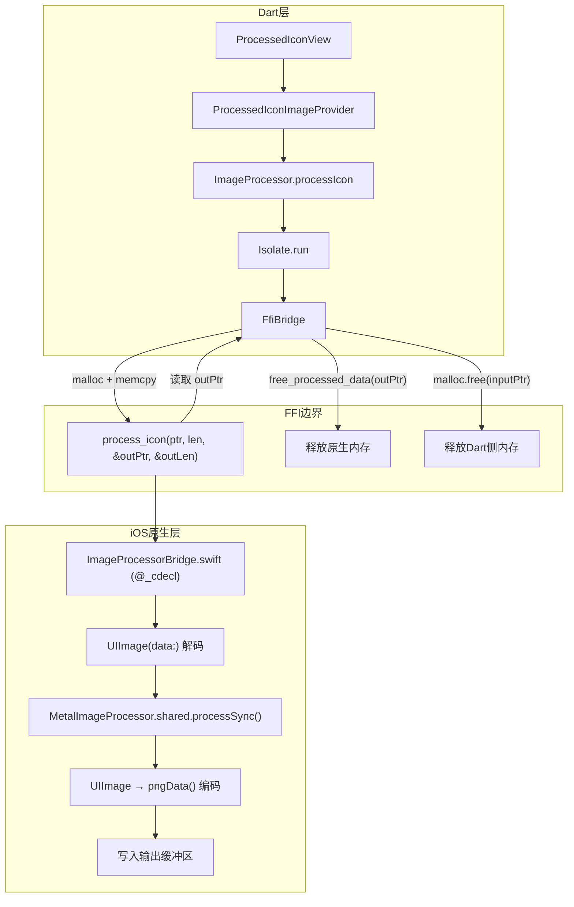

# 设计文档：FFI 图像处理器

## 概述

本设计将 lt_app 的图像后处理通道从 `FlutterMethodChannel` 迁移到 `dart:ffi`，消除 Dart ↔ 原生之间的序列化/反序列化和深拷贝开销。

当前架构中，`ImageProcessor` 通过 `MethodChannel("com.ltapp.image_processor")` 将 `Uint8List` 发送到 iOS 原生端，原生端将其解码为 `UIImage`，调用 `MetalImageProcessor.shared.processSync()` 进行 GPU 处理（内容边界检测 + 加粗去背景），再将结果编码为 PNG 返回。整个过程涉及多次数据拷贝：Dart → Platform Channel 序列化 → 原生端 `FlutterStandardTypedData` 解码 → `UIImage` 构建 → 处理 → PNG 编码 → 序列化回 Dart。

新架构通过 `dart:ffi` 直接传递内存指针，原生端暴露 C 函数接口（`@_cdecl`），Dart 侧通过 `DynamicLibrary.process()` 绑定并调用。Metal GPU 处理管线保持不变。

### 关键设计决策

1. **使用 `DynamicLibrary.process()` 而非 `DynamicLibrary.open()`**：iOS 静态链接的 App 中，所有符号都在主进程中，使用 `.process()` 即可查找 `@_cdecl` 导出的符号，无需额外的 `.dylib` 文件。

2. **C 接口采用指针 + 长度模式**：`process_icon(input_ptr, input_len, output_ptr_ptr, output_len_ptr) -> status_code`，这是 FFI 跨语言交互的标准模式，简单且安全。

3. **Dart 侧使用 `Isolate.run` 执行 FFI 调用**：FFI 调用本身是同步的（原生端内部的 Metal 处理是 GPU 异步但 CPU 等待完成），需要在 isolate 中执行以避免阻塞 UI 线程。

4. **保持 `ImageProcessor.processIcon()` 公开 API 不变**：上层 `ProcessedIconImageProvider` 和 `ProcessedIconView` 无需任何修改。

## 架构

### 数据流对比

**当前 MethodChannel 流程：**
```
ProcessedIconView → ProcessedIconImageProvider → ImageProcessor.processIcon(bytes)
  → MethodChannel.invokeListMethod('processIcon', {imageData: bytes})
    → [序列化] → AppDelegate.setMethodCallHandler
      → FlutterStandardTypedData → UIImage(data:) → MetalImageProcessor.processSync()
        → UIImage → pngData() → [序列化回 Dart] → Uint8List
```

**目标 FFI 流程：**
```
ProcessedIconView → ProcessedIconImageProvider → ImageProcessor.processIcon(bytes)
  → Isolate.run(() => FfiBridge.processIcon(bytes))
    → malloc(input) → memcpy → process_icon(ptr, len, &outPtr, &outLen)
      → UIImage(data:) → MetalImageProcessor.processSync()
        → UIImage → pngData() → 写入 outPtr
    → asTypedList(outLen) → Uint8List.fromList() → free(input) → free_processed_data(outPtr)
```

### 架构图




## 组件与接口

### 1. C_Bridge — `ImageProcessorBridge.swift`

位置：`apps/lt_app/ios/Runner/ImageProcessorBridge.swift`

原生侧暴露给 FFI 的 C 接口层。使用 Swift 的 `@_cdecl` 属性将函数以 C 链接方式导出。

```swift
// process_icon: 接收输入图像数据，调用 MetalImageProcessor 处理，写回结果
@_cdecl("process_icon")
func processIcon(
    _ inputData: UnsafePointer<UInt8>,
    _ inputLength: Int32,
    _ outputData: UnsafeMutablePointer<UnsafeMutablePointer<UInt8>?>,
    _ outputLength: UnsafeMutablePointer<Int32>
) -> Int32

// free_processed_data: 释放 process_icon 分配的输出内存
@_cdecl("free_processed_data")
func freeProcessedData(_ pointer: UnsafeMutablePointer<UInt8>?)
```

**内部流程：**
1. 从 `inputData` 指针构建 `Data(bytes:count:)`
2. 从 `Data` 构建 `UIImage`
3. 调用 `MetalImageProcessor.shared.processSync(uiImage, thickness: 4)`
4. 将结果 `UIImage` 编码为 PNG (`pngData()`)
5. 分配输出缓冲区 (`malloc`)，拷贝 PNG 数据，设置 `outputData` 和 `outputLength`
6. 返回状态码 0（成功）或非零（失败）

### 2. FFI_Bridge — `ffi_bridge.dart`

位置：`packages/core/lt_uicomponent/lib/src/image_processor/ffi_bridge.dart`

Dart 侧 FFI 绑定层，负责加载原生符号、分配/释放内存、调用原生函数。

```dart
/// 原生函数类型定义
typedef ProcessIconNative = Int32 Function(
  Pointer<Uint8> inputData,
  Int32 inputLength,
  Pointer<Pointer<Uint8>> outputData,
  Pointer<Int32> outputLength,
);
typedef ProcessIconDart = int Function(
  Pointer<Uint8> inputData,
  int inputLength,
  Pointer<Pointer<Uint8>> outputData,
  Pointer<Int32> outputLength,
);

typedef FreeProcessedDataNative = Void Function(Pointer<Uint8> pointer);
typedef FreeProcessedDataDart = void Function(Pointer<Uint8> pointer);

class FfiBridge {
  static final DynamicLibrary _lib = DynamicLibrary.process();

  static final ProcessIconDart _processIcon = _lib
      .lookupFunction<ProcessIconNative, ProcessIconDart>('process_icon');

  static final FreeProcessedDataDart _freeProcessedData = _lib
      .lookupFunction<FreeProcessedDataNative, FreeProcessedDataDart>(
          'free_processed_data');

  /// 调用原生 process_icon，返回处理后的 PNG 数据，失败返回 null
  static Uint8List? processIcon(Uint8List imageBytes) { ... }
}
```

**`processIcon` 方法流程：**
1. `malloc<Uint8>(imageBytes.length)` 分配输入缓冲区
2. `inputPtr.asTypedList(length).setAll(0, imageBytes)` 拷贝数据
3. `malloc<Pointer<Uint8>>()` 分配输出指针
4. `malloc<Int32>()` 分配输出长度
5. 调用 `_processIcon(inputPtr, length, outPtrPtr, outLenPtr)`
6. 检查返回状态码
7. 成功时：`Uint8List.fromList(outPtr.asTypedList(outLen))` 拷贝输出数据到 Dart 堆
8. `finally` 块中释放所有原生内存：`_freeProcessedData(outPtr)`, `malloc.free(inputPtr)`, `malloc.free(outPtrPtr)`, `malloc.free(outLenPtr)`

### 3. Image_Processor — `image_processor.dart`（修改）

位置：`packages/core/lt_uicomponent/lib/src/image_processor/image_processor.dart`

修改现有 `ImageProcessor` 类，将内部实现从 MethodChannel 切换为 FFI。

```dart
class ImageProcessor {
  // 移除: static const MethodChannel _channel = ...

  static Future<Uint8List?> processIcon(Uint8List imageBytes) async {
    try {
      return await Isolate.run(() => FfiBridge.processIcon(imageBytes));
    } catch (e) {
      print("Failed to process image: '$e'");
      return null;
    }
  }
}
```

**关键点：**
- 公开 API 签名完全不变：`static Future<Uint8List?> processIcon(Uint8List imageBytes)`
- 使用 `Isolate.run` 在后台 isolate 执行同步 FFI 调用
- `IconParams` 类保持不变（被 `ProcessedIconImageProvider` 使用）

### 4. 不变组件

以下组件无需修改：
- **`ProcessedIconImageProvider`**：继续调用 `ImageProcessor.processIcon()`，流程不变
- **`ProcessedIconView`**：继续使用 `ProcessedIconImageProvider`，无感知
- **`MetalImageProcessor.swift`**：GPU 处理逻辑完全不变
- **`Shaders.metal`**：Metal 着色器不变

## 数据模型

本特性不引入新的业务数据模型。核心数据交互通过 FFI 指针和原始字节进行：

### FFI 数据传递结构

| 参数 | 类型 (C) | 类型 (Dart FFI) | 说明 |
|------|----------|-----------------|------|
| `inputData` | `const uint8_t*` | `Pointer<Uint8>` | 输入 PNG/图像原始字节 |
| `inputLength` | `int32_t` | `int` (via `Int32`) | 输入数据长度 |
| `outputData` | `uint8_t**` | `Pointer<Pointer<Uint8>>` | 输出 PNG 数据指针的指针 |
| `outputLength` | `int32_t*` | `Pointer<Int32>` | 输出数据长度的指针 |
| 返回值 | `int32_t` | `int` | 状态码：0=成功，非零=失败 |

### 状态码定义

| 状态码 | 含义 |
|--------|------|
| `0` | 处理成功 |
| `1` | 输入数据无法解码为 UIImage |
| `2` | MetalImageProcessor 处理失败 |
| `3` | 处理结果无法编码为 PNG |

### 内存所有权模型

```
Dart 侧分配（malloc）→ Dart 侧释放（malloc.free）:
  - inputPtr: 输入数据缓冲区
  - outPtrPtr: 输出指针的指针
  - outLenPtr: 输出长度的指针

原生侧分配（malloc）→ Dart 侧通过 free_processed_data 释放:
  - *outPtrPtr: 实际的输出 PNG 数据缓冲区
```


## 正确性属性

*属性（Property）是在系统所有有效执行中都应成立的特征或行为——本质上是对系统应做什么的形式化陈述。属性是人类可读规格说明与机器可验证正确性保证之间的桥梁。*

### 属性 1：内存拷贝保真性

*对于任意* `Uint8List` 输入数据（包括空数组、单字节、大数组），通过 `malloc` 分配原生内存并拷贝后，原生内存中的字节序列应与原始 Dart `Uint8List` 完全一致。

**验证需求：2.3**

### 属性 2：FFI 调用异常安全性

*对于任意* 字节数组输入（包括空数组、随机垃圾数据、超大数据、有效图像数据），调用 `FfiBridge.processIcon` 应始终正常返回（返回 `Uint8List` 或 `null`），不应抛出未捕获异常或导致进程崩溃。这隐含验证了所有分配的原生内存在正常和异常路径下都被正确释放。

**验证需求：4.1, 4.2, 4.3**

## 错误处理

### 错误传播链

```
MetalImageProcessor 失败
  → C_Bridge 返回非零状态码，输出指针为 null
    → FfiBridge.processIcon 返回 null
      → ImageProcessor.processIcon 返回 null
        → ProcessedIconImageProvider 抛出 Exception
          → ProcessedIconView 显示 placeholder
```

### 各层错误处理策略

| 层 | 错误场景 | 处理方式 |
|----|----------|----------|
| C_Bridge | 输入数据无法解码为 UIImage | 返回状态码 1，输出长度设为 0 |
| C_Bridge | MetalImageProcessor 返回 nil | 返回状态码 2，输出长度设为 0 |
| C_Bridge | PNG 编码失败 | 返回状态码 3，输出长度设为 0 |
| FfiBridge | 原生函数返回非零状态码 | 返回 null |
| FfiBridge | FFI 调用过程中抛出异常 | finally 块释放所有原生内存，异常向上传播 |
| ImageProcessor | FfiBridge 返回 null 或抛出异常 | catch 块打印错误，返回 null |
| ProcessedIconImageProvider | processIcon 返回 null | 抛出 Exception，触发 errorBuilder |

### 内存安全保证

`FfiBridge.processIcon` 的内存管理采用 `try/finally` 模式：

```dart
Pointer<Uint8> inputPtr = nullptr;
Pointer<Pointer<Uint8>> outPtrPtr = nullptr;
Pointer<Int32> outLenPtr = nullptr;
try {
  inputPtr = malloc<Uint8>(imageBytes.length);
  // ... 拷贝数据、调用原生函数、读取结果 ...
} finally {
  // 始终释放 Dart 侧分配的内存
  if (inputPtr != nullptr) malloc.free(inputPtr);
  if (outPtrPtr != nullptr) {
    // 释放原生侧分配的输出缓冲区
    final outPtr = outPtrPtr.value;
    if (outPtr != nullptr) _freeProcessedData(outPtr);
    malloc.free(outPtrPtr);
  }
  if (outLenPtr != nullptr) malloc.free(outLenPtr);
}
```

## 测试策略

### 属性测试（Property-Based Testing）

本特性适合属性测试的部分是 Dart 侧的 FFI 桥接逻辑（纯函数式的内存分配和拷贝操作）。

- **测试库**：使用 `glados`（Dart 属性测试库）
- **最低迭代次数**：每个属性测试 100 次
- **标签格式**：`Feature: ffi-image-processor, Property {number}: {property_text}`

#### 属性测试 1：内存拷贝保真性
- 生成随机 `Uint8List`（长度从 0 到 10MB）
- 通过 `malloc` 分配原生内存并拷贝
- 验证 `inputPtr.asTypedList(length)` 与原始数据逐字节一致
- 释放内存
- 此测试不需要真机，可在任何平台运行

#### 属性测试 2：FFI 调用异常安全性
- 生成随机字节数组（包括空、小、大、随机内容）
- 调用 `FfiBridge.processIcon`
- 验证返回值为 `Uint8List` 或 `null`（不抛出异常）
- 此测试需要在 iOS 真机/模拟器上运行（需要 Metal）

### 单元测试

| 测试场景 | 验证内容 | 需求 |
|----------|----------|------|
| FfiBridge 符号绑定 | `DynamicLibrary.process()` 能成功查找 `process_icon` 和 `free_processed_data` | 1.1, 1.5, 1.6, 2.1, 2.2 |
| 有效图像处理 | 传入有效 PNG 数据，返回非空 `Uint8List`，且以 PNG 魔数开头 | 1.3, 2.4, 6.2 |
| 无效数据处理 | 传入空数据/垃圾数据，返回 null | 1.4, 2.6, 4.4 |
| ImageProcessor API 兼容性 | `processIcon` 签名为 `Future<Uint8List?>` | 3.1 |
| MethodChannel 清理 | `image_processor.dart` 中无 MethodChannel 引用 | 5.1 |
| AppDelegate 清理 | `AppDelegate.swift` 中无 image_processor MethodChannel 代码 | 5.2 |

### 集成测试

| 测试场景 | 验证内容 | 需求 |
|----------|----------|------|
| 端到端图像处理 | 在真机上通过 `ImageProcessor.processIcon` 处理测试图像，验证输出为有效 PNG | 1.2, 1.3, 3.4 |
| 处理结果一致性 | 同一图像分别通过 FFI 和 MethodChannel 处理，输出字节一致 | 6.1, 6.3 |
| 错误路径 | 传入无效数据，验证返回 null 且无崩溃 | 3.5 |
| 内存压力测试 | 连续处理 100+ 张图像，监控内存无持续增长 | 4.1, 4.2, 4.3 |

### 测试环境要求

- 属性测试 1（内存拷贝）：可在任何平台运行（纯 Dart + FFI malloc）
- 属性测试 2 + 集成测试：需要 iOS 真机或模拟器（Metal GPU 依赖）
- 单元测试中的符号绑定测试：需要 iOS 环境（`DynamicLibrary.process()` 查找 App 内符号）
