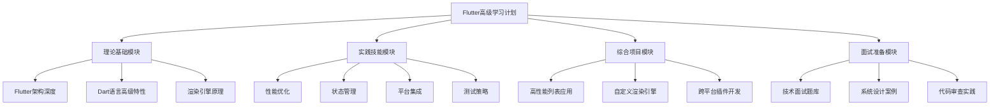
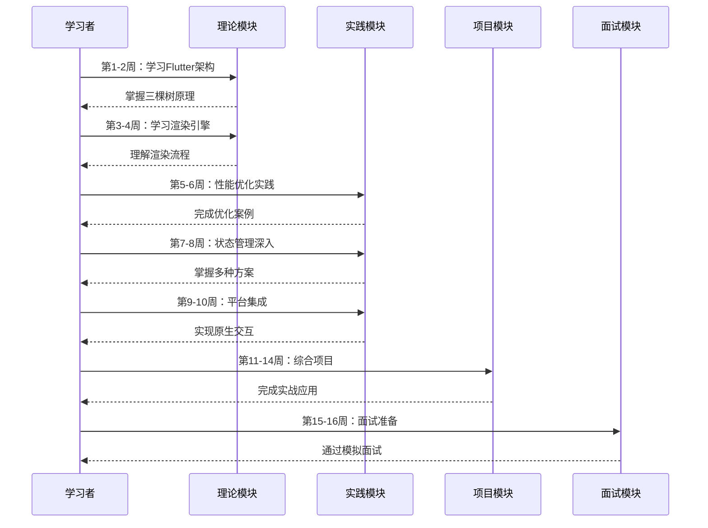
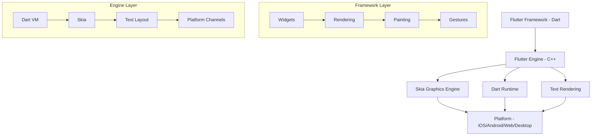

# 设计文档：Flutter高级学习计划系统

## 概述

本设计文档定义了一个系统化的Flutter深度学习计划，旨在帮助已具备基础Flutter开发能力的iOS工程师提升到资深Flutter工程师水平。该学习计划涵盖Flutter底层原理、架构设计、性能优化、状态管理、平台集成等核心技术领域，并通过实战项目和面试准备模块，确保学习者能够通过资深Flutter工程师面试。

学习计划采用渐进式架构，从理论基础到实践应用，从单一模块到综合项目，确保知识体系的完整性和实用性。每个学习模块都包含理论讲解、代码示例、实践项目和评估标准。

## 整体架构



## 学习路径序列图




## 核心组件和接口

### 组件 1：学习模块管理器

**目的**：管理学习进度、模块依赖关系和完成状态

**接口**：
```dart
abstract class LearningModule {
  String get moduleId;
  String get title;
  Duration get estimatedDuration;
  List<String> get prerequisites;
  ModuleDifficulty get difficulty;
  
  Future<void> start();
  Future<bool> complete();
  Future<LearningProgress> getProgress();
}

class LearningModuleManager {
  Future<List<LearningModule>> getAvailableModules();
  Future<void> enrollModule(String moduleId);
  Future<bool> canStartModule(String moduleId);
  Future<void> trackProgress(String moduleId, double progress);
  Future<List<LearningModule>> getRecommendedNext();
}

enum ModuleDifficulty {
  beginner,
  intermediate,
  advanced,
  expert
}

class LearningProgress {
  final String moduleId;
  final double completionPercentage;
  final Duration timeSpent;
  final List<String> completedLessons;
  final Map<String, dynamic> assessmentScores;
}
```

**职责**：
- 跟踪学习进度和完成状态
- 管理模块之间的依赖关系
- 推荐下一步学习内容
- 记录学习时间和评估分数

### 组件 2：代码示例库

**目的**：提供可运行的代码示例和实践项目模板

**接口**：
```dart
abstract class CodeExample {
  String get exampleId;
  String get title;
  String get description;
  CodeComplexity get complexity;
  List<String> get tags;
  
  String getSourceCode();
  Future<void> run();
  Future<List<String>> getExplanation();
}

class CodeExampleRepository {
  Future<List<CodeExample>> getExamplesByModule(String moduleId);
  Future<List<CodeExample>> searchByTag(List<String> tags);
  Future<CodeExample> getExampleById(String exampleId);
  Future<void> saveUserModification(String exampleId, String code);
}

enum CodeComplexity {
  simple,
  moderate,
  complex,
  advanced
}
```

**职责**：
- 存储和检索代码示例
- 支持代码运行和调试
- 提供详细的代码解释
- 保存用户的代码修改

### 组件 3：评估系统

**目的**：评估学习效果和技能掌握程度

**接口**：
```dart
abstract class Assessment {
  String get assessmentId;
  String get moduleId;
  AssessmentType get type;
  int get totalPoints;
  
  Future<void> start();
  Future<AssessmentResult> submit(Map<String, dynamic> answers);
}

class AssessmentSystem {
  Future<List<Assessment>> getAssessmentsForModule(String moduleId);
  Future<AssessmentResult> evaluateSubmission(
    String assessmentId,
    Map<String, dynamic> answers
  );
  Future<List<AssessmentResult>> getUserHistory(String userId);
  Future<SkillProfile> generateSkillProfile(String userId);
}

enum AssessmentType {
  quiz,
  codingChallenge,
  projectReview,
  mockInterview
}

class AssessmentResult {
  final String assessmentId;
  final int score;
  final int totalPoints;
  final Map<String, bool> questionResults;
  final List<String> feedback;
  final DateTime completedAt;
}

class SkillProfile {
  final Map<String, double> skillLevels;
  final List<String> strengths;
  final List<String> areasForImprovement;
  final double overallReadiness;
}
```

**职责**：
- 创建和管理评估测试
- 评估用户提交的答案
- 生成技能档案和反馈
- 跟踪学习历史


## 数据模型

### 模型 1：学习模块

```dart
class LearningModuleModel {
  final String id;
  final String title;
  final String description;
  final ModuleDifficulty difficulty;
  final Duration estimatedDuration;
  final List<String> prerequisites;
  final List<Lesson> lessons;
  final List<String> learningObjectives;
  final List<Resource> resources;
  final Assessment? finalAssessment;
}

class Lesson {
  final String id;
  final String title;
  final LessonType type;
  final String content;
  final List<CodeExample> examples;
  final Duration estimatedTime;
  final List<String> keyTakeaways;
}

enum LessonType {
  theory,
  tutorial,
  practice,
  project
}

class Resource {
  final String title;
  final String url;
  final ResourceType type;
  final String description;
}

enum ResourceType {
  documentation,
  article,
  video,
  repository,
  tool
}
```

**验证规则**：
- id 必须唯一且非空
- title 长度在 5-100 字符之间
- prerequisites 中的模块 id 必须存在
- lessons 列表不能为空
- estimatedDuration 必须大于 0

### 模型 2：用户学习记录

```dart
class UserLearningRecord {
  final String userId;
  final String moduleId;
  final LearningStatus status;
  final DateTime enrolledAt;
  final DateTime? completedAt;
  final Duration totalTimeSpent;
  final Map<String, LessonProgress> lessonProgress;
  final List<Note> notes;
  final List<String> bookmarkedExamples;
}

enum LearningStatus {
  notStarted,
  inProgress,
  completed,
  paused
}

class LessonProgress {
  final String lessonId;
  final bool completed;
  final DateTime? completedAt;
  final Duration timeSpent;
  final int attemptsCount;
}

class Note {
  final String id;
  final String lessonId;
  final String content;
  final DateTime createdAt;
  final DateTime? updatedAt;
}
```

**验证规则**：
- userId 和 moduleId 必须有效
- enrolledAt 不能晚于 completedAt
- status 为 completed 时，completedAt 必须存在
- totalTimeSpent 必须非负


## 核心算法伪代码

### 算法 1：学习路径推荐算法

```dart
/// 根据用户当前技能水平和学习历史推荐下一步学习模块
/// 
/// 前置条件：
/// - userId 必须有效且存在
/// - 用户至少完成了一个模块或进行了技能评估
/// 
/// 后置条件：
/// - 返回按优先级排序的推荐模块列表
/// - 推荐模块的前置条件都已满足
/// - 列表长度不超过 maxRecommendations
Future<List<LearningModule>> recommendNextModules({
  required String userId,
  required int maxRecommendations,
}) async {
  // 步骤 1：获取用户学习历史和技能档案
  final userHistory = await getUserLearningHistory(userId);
  final skillProfile = await getSkillProfile(userId);
  final completedModules = userHistory
      .where((record) => record.status == LearningStatus.completed)
      .map((record) => record.moduleId)
      .toSet();
  
  // 步骤 2：获取所有可用模块
  final allModules = await getAllModules();
  
  // 步骤 3：过滤出可以开始的模块（前置条件已满足）
  final availableModules = <LearningModule>[];
  for (final module in allModules) {
    if (completedModules.contains(module.moduleId)) {
      continue; // 跳过已完成的模块
    }
    
    // 检查前置条件
    final prerequisitesMet = module.prerequisites.every(
      (prereq) => completedModules.contains(prereq)
    );
    
    if (prerequisitesMet) {
      availableModules.add(module);
    }
  }
  
  // 步骤 4：计算每个模块的推荐分数
  final scoredModules = <({LearningModule module, double score})>[];
  for (final module in availableModules) {
    double score = 0.0;
    
    // 因素 1：技能匹配度（40%权重）
    final skillMatch = calculateSkillMatch(module, skillProfile);
    score += skillMatch * 0.4;
    
    // 因素 2：难度适配度（30%权重）
    final difficultyFit = calculateDifficultyFit(
      module.difficulty,
      skillProfile.overallReadiness
    );
    score += difficultyFit * 0.3;
    
    // 因素 3：学习路径连贯性（20%权重）
    final pathCoherence = calculatePathCoherence(
      module,
      completedModules,
      allModules
    );
    score += pathCoherence * 0.2;
    
    // 因素 4：用户兴趣（10%权重）
    final interestScore = calculateInterestScore(module, userHistory);
    score += interestScore * 0.1;
    
    scoredModules.add((module: module, score: score));
  }
  
  // 步骤 5：按分数排序并返回前 N 个
  scoredModules.sort((a, b) => b.score.compareTo(a.score));
  
  return scoredModules
      .take(maxRecommendations)
      .map((item) => item.module)
      .toList();
}

/// 计算模块与用户技能档案的匹配度
/// 返回值范围：0.0 - 1.0
double calculateSkillMatch(
  LearningModule module,
  SkillProfile profile
) {
  // 获取模块涉及的技能领域
  final moduleSkills = getModuleSkills(module);
  
  if (moduleSkills.isEmpty) return 0.5; // 默认中等匹配
  
  double totalMatch = 0.0;
  for (final skill in moduleSkills) {
    final userLevel = profile.skillLevels[skill] ?? 0.0;
    final requiredLevel = getRequiredSkillLevel(module, skill);
    
    // 如果用户技能略低于要求，给予高分（学习机会）
    // 如果用户技能远低于要求，给予低分（太难）
    // 如果用户技能远高于要求，给予低分（太简单）
    final gap = (requiredLevel - userLevel).abs();
    
    if (gap <= 0.2) {
      totalMatch += 1.0; // 完美匹配
    } else if (gap <= 0.4) {
      totalMatch += 0.7; // 良好匹配
    } else {
      totalMatch += 0.3; // 较差匹配
    }
  }
  
  return totalMatch / moduleSkills.length;
}
```


### 算法 2：技能评估算法

```dart
/// 基于用户的学习记录和评估结果生成技能档案
/// 
/// 前置条件：
/// - userId 必须有效
/// - 用户至少完成了一次评估或一个模块
/// 
/// 后置条件：
/// - 返回包含所有技能领域评分的档案
/// - 每个技能评分在 0.0 - 1.0 之间
/// - 识别出至少 3 个优势领域和改进领域
Future<SkillProfile> generateSkillProfile(String userId) async {
  // 步骤 1：收集所有评估结果
  final assessmentResults = await getAssessmentHistory(userId);
  final learningRecords = await getUserLearningHistory(userId);
  
  // 步骤 2：初始化技能评分映射
  final skillScores = <String, List<double>>{};
  
  // 步骤 3：从评估结果中提取技能分数
  for (final result in assessmentResults) {
    final assessment = await getAssessment(result.assessmentId);
    final skills = getAssessmentSkills(assessment);
    
    for (final skill in skills) {
      final scorePercentage = result.score / result.totalPoints;
      skillScores.putIfAbsent(skill, () => []).add(scorePercentage);
    }
  }
  
  // 步骤 4：从学习记录中推断技能水平
  for (final record in learningRecords) {
    if (record.status != LearningStatus.completed) continue;
    
    final module = await getModule(record.moduleId);
    final skills = getModuleSkills(module);
    
    // 根据完成时间和尝试次数推断掌握程度
    final efficiency = calculateLearningEfficiency(record);
    
    for (final skill in skills) {
      skillScores.putIfAbsent(skill, () => []).add(efficiency);
    }
  }
  
  // 步骤 5：计算每个技能的平均分数（加权平均，最近的权重更高）
  final skillLevels = <String, double>{};
  for (final entry in skillScores.entries) {
    final scores = entry.value;
    
    // 应用时间衰减权重：最近的分数权重更高
    double weightedSum = 0.0;
    double totalWeight = 0.0;
    
    for (int i = 0; i < scores.length; i++) {
      final weight = 1.0 + (i * 0.1); // 越新的分数权重越高
      weightedSum += scores[i] * weight;
      totalWeight += weight;
    }
    
    skillLevels[entry.key] = weightedSum / totalWeight;
  }
  
  // 步骤 6：识别优势和改进领域
  final sortedSkills = skillLevels.entries.toList()
    ..sort((a, b) => b.value.compareTo(a.value));
  
  final strengths = sortedSkills
      .take(3)
      .where((e) => e.value >= 0.7)
      .map((e) => e.key)
      .toList();
  
  final areasForImprovement = sortedSkills
      .reversed
      .take(3)
      .where((e) => e.value < 0.6)
      .map((e) => e.key)
      .toList();
  
  // 步骤 7：计算整体准备度
  final overallReadiness = skillLevels.values.isEmpty
      ? 0.0
      : skillLevels.values.reduce((a, b) => a + b) / skillLevels.length;
  
  return SkillProfile(
    skillLevels: skillLevels,
    strengths: strengths,
    areasForImprovement: areasForImprovement,
    overallReadiness: overallReadiness,
  );
}

/// 计算学习效率分数
/// 基于完成时间与预估时间的比率，以及尝试次数
double calculateLearningEfficiency(UserLearningRecord record) {
  final estimatedDuration = getModuleEstimatedDuration(record.moduleId);
  final actualDuration = record.totalTimeSpent;
  
  // 时间效率：实际时间 / 预估时间
  final timeRatio = actualDuration.inMinutes / estimatedDuration.inMinutes;
  double timeScore;
  
  if (timeRatio <= 1.0) {
    timeScore = 1.0; // 在预估时间内完成
  } else if (timeRatio <= 1.5) {
    timeScore = 0.8; // 稍微超时
  } else if (timeRatio <= 2.0) {
    timeScore = 0.6; // 明显超时
  } else {
    timeScore = 0.4; // 严重超时
  }
  
  // 尝试次数惩罚
  final avgAttempts = record.lessonProgress.values
      .map((p) => p.attemptsCount)
      .reduce((a, b) => a + b) / record.lessonProgress.length;
  
  double attemptScore;
  if (avgAttempts <= 1.5) {
    attemptScore = 1.0;
  } else if (avgAttempts <= 2.5) {
    attemptScore = 0.8;
  } else {
    attemptScore = 0.6;
  }
  
  // 综合评分
  return (timeScore * 0.6) + (attemptScore * 0.4);
}
```


## 关键函数的形式化规范

### 函数 1：enrollModule()

```dart
Future<void> enrollModule(String userId, String moduleId);
```

**前置条件：**
- `userId` 必须是有效的用户标识符
- `moduleId` 必须是存在的模块标识符
- 用户未曾注册过该模块（避免重复注册）
- 模块的所有前置条件模块都已完成

**后置条件：**
- 创建新的 `UserLearningRecord` 记录
- 记录的 `status` 为 `LearningStatus.notStarted`
- 记录的 `enrolledAt` 为当前时间戳
- 用户可以访问该模块的所有课程内容

**循环不变量：** 不适用（无循环）

### 函数 2：trackProgress()

```dart
Future<void> trackProgress(
  String userId,
  String moduleId,
  String lessonId,
  double progress,
);
```

**前置条件：**
- `userId` 和 `moduleId` 必须有效
- 用户已注册该模块
- `lessonId` 属于该模块
- `progress` 在 0.0 到 1.0 之间

**后置条件：**
- 更新对应课程的进度记录
- 如果 `progress >= 1.0`，标记课程为已完成
- 更新模块的总体进度百分比
- 增加 `totalTimeSpent` 计数

**循环不变量：** 不适用（无循环）

### 函数 3：submitAssessment()

```dart
Future<AssessmentResult> submitAssessment(
  String userId,
  String assessmentId,
  Map<String, dynamic> answers,
);
```

**前置条件：**
- `userId` 和 `assessmentId` 必须有效
- 用户已开始该评估
- `answers` 包含所有必答题的答案
- 答案格式符合题目要求

**后置条件：**
- 返回包含分数和反馈的 `AssessmentResult`
- 结果保存到用户的评估历史
- 如果是模块最终评估且通过，更新模块状态为已完成
- 触发技能档案重新计算

**循环不变量：** 
- 在评分循环中：已评分题目的分数总和保持一致
- 每道题只被评分一次


## Flutter学习内容详细设计

### 模块 1：Flutter架构深度理解

**学习目标：**
- 理解Flutter的三棵树（Widget树、Element树、RenderObject树）
- 掌握Flutter的渲染流水线
- 理解BuildContext的本质和使用场景

**核心概念代码示例：**

```dart
/// 示例 1：理解Widget、Element、RenderObject的关系
/// 
/// Widget是配置信息的不可变描述
class CustomWidget extends StatelessWidget {
  final String data;
  
  const CustomWidget({Key? key, required this.data}) : super(key: key);
  
  @override
  Widget build(BuildContext context) {
    // Widget.build() 返回Widget树的描述
    return Container(
      child: Text(data),
    );
  }
}

/// Element是Widget的实例化，持有Widget和RenderObject的引用
/// Element的生命周期：
/// 1. mount() - 挂载到树上
/// 2. update() - 更新配置
/// 3. unmount() - 从树上移除

/// 自定义RenderObject示例
class CustomRenderBox extends RenderBox {
  Color _color;
  
  CustomRenderBox({required Color color}) : _color = color;
  
  Color get color => _color;
  set color(Color value) {
    if (_color == value) return;
    _color = value;
    markNeedsPaint(); // 标记需要重绘
  }
  
  @override
  void performLayout() {
    // 布局阶段：计算自身大小
    size = constraints.biggest;
  }
  
  @override
  void paint(PaintingContext context, Offset offset) {
    // 绘制阶段：在canvas上绘制
    final paint = Paint()
      ..color = _color
      ..style = PaintingStyle.fill;
    
    context.canvas.drawRect(
      offset & size,
      paint,
    );
  }
}

/// 示例 2：BuildContext的本质
/// BuildContext实际上是Element的抽象接口
void demonstrateBuildContext(BuildContext context) {
  // context.findAncestorWidgetOfExactType 向上遍历Element树
  final scaffold = context.findAncestorWidgetOfExactType<Scaffold>();
  
  // context.findRenderObject 获取对应的RenderObject
  final renderBox = context.findRenderObject() as RenderBox?;
  
  // Theme.of(context) 实际上是通过InheritedWidget机制
  // 向上查找最近的Theme
  final theme = Theme.of(context);
}
```

**渲染流水线示例：**

```dart
/// Flutter渲染流水线的三个阶段
/// 
/// 1. Build阶段：构建Widget树
/// 2. Layout阶段：计算每个RenderObject的大小和位置
/// 3. Paint阶段：将RenderObject绘制到屏幕

class RenderPipelineDemo extends StatefulWidget {
  @override
  State<RenderPipelineDemo> createState() => _RenderPipelineDemoState();
}

class _RenderPipelineDemoState extends State<RenderPipelineDemo> {
  int _counter = 0;
  
  @override
  Widget build(BuildContext context) {
    print('Build phase: Creating widget tree');
    
    // Build阶段：创建Widget树
    return CustomPaint(
      painter: CounterPainter(_counter),
      child: GestureDetector(
        onTap: () {
          setState(() {
            _counter++;
            // setState触发rebuild，但不一定触发layout和paint
          });
        },
        child: Container(
          width: 200,
          height: 200,
          color: Colors.blue,
        ),
      ),
    );
  }
}

class CounterPainter extends CustomPainter {
  final int counter;
  
  CounterPainter(this.counter);
  
  @override
  void paint(Canvas canvas, Size size) {
    print('Paint phase: Drawing on canvas');
    
    // Paint阶段：在canvas上绘制
    final textPainter = TextPainter(
      text: TextSpan(
        text: 'Count: $counter',
        style: TextStyle(color: Colors.white, fontSize: 24),
      ),
      textDirection: TextDirection.ltr,
    );
    
    textPainter.layout();
    textPainter.paint(
      canvas,
      Offset(size.width / 2 - textPainter.width / 2, size.height / 2),
    );
  }
  
  @override
  bool shouldRepaint(CounterPainter oldDelegate) {
    // 返回true时才会触发重绘
    return oldDelegate.counter != counter;
  }
}
```


### 模块 2：性能优化深度实践

**学习目标：**
- 掌握Flutter性能分析工具的使用
- 理解并避免常见的性能陷阱
- 实现高性能的列表和动画

**性能优化代码示例：**

```dart
/// 示例 1：避免不必要的rebuild
/// 
/// 问题：整个列表在每次状态变化时都会rebuild
class BadPerformanceList extends StatefulWidget {
  @override
  State<BadPerformanceList> createState() => _BadPerformanceListState();
}

class _BadPerformanceListState extends State<BadPerformanceList> {
  int _selectedIndex = 0;
  
  @override
  Widget build(BuildContext context) {
    return ListView.builder(
      itemCount: 1000,
      itemBuilder: (context, index) {
        // 每次setState都会重建所有可见的item
        return ListTile(
          title: Text('Item $index'),
          selected: index == _selectedIndex,
          onTap: () => setState(() => _selectedIndex = index),
        );
      },
    );
  }
}

/// 优化方案：使用const构造函数和局部状态
class OptimizedPerformanceList extends StatefulWidget {
  @override
  State<OptimizedPerformanceList> createState() => 
      _OptimizedPerformanceListState();
}

class _OptimizedPerformanceListState extends State<OptimizedPerformanceList> {
  int _selectedIndex = 0;
  
  @override
  Widget build(BuildContext context) {
    return ListView.builder(
      itemCount: 1000,
      itemBuilder: (context, index) {
        // 使用独立的StatefulWidget，只rebuild被点击的item
        return OptimizedListItem(
          index: index,
          isSelected: index == _selectedIndex,
          onTap: () => setState(() => _selectedIndex = index),
        );
      },
    );
  }
}

class OptimizedListItem extends StatelessWidget {
  final int index;
  final bool isSelected;
  final VoidCallback onTap;
  
  const OptimizedListItem({
    Key? key,
    required this.index,
    required this.isSelected,
    required this.onTap,
  }) : super(key: key);
  
  @override
  Widget build(BuildContext context) {
    return ListTile(
      title: Text('Item $index'),
      selected: isSelected,
      onTap: onTap,
    );
  }
}

/// 示例 2：使用RepaintBoundary隔离重绘区域
class RepaintOptimizationDemo extends StatefulWidget {
  @override
  State<RepaintOptimizationDemo> createState() => 
      _RepaintOptimizationDemoState();
}

class _RepaintOptimizationDemoState extends State<RepaintOptimizationDemo>
    with SingleTickerProviderStateMixin {
  late AnimationController _controller;
  
  @override
  void initState() {
    super.initState();
    _controller = AnimationController(
      duration: const Duration(seconds: 2),
      vsync: this,
    )..repeat();
  }
  
  @override
  Widget build(BuildContext context) {
    return Column(
      children: [
        // 静态内容，不需要重绘
        const RepaintBoundary(
          child: ExpensiveStaticWidget(),
        ),
        
        // 动画内容，频繁重绘
        RepaintBoundary(
          child: AnimatedBuilder(
            animation: _controller,
            builder: (context, child) {
              return Transform.rotate(
                angle: _controller.value * 2 * 3.14159,
                child: child,
              );
            },
            child: const FlutterLogo(size: 100),
          ),
        ),
        
        // 另一个静态内容
        const RepaintBoundary(
          child: ExpensiveStaticWidget(),
        ),
      ],
    );
  }
  
  @override
  void dispose() {
    _controller.dispose();
    super.dispose();
  }
}

class ExpensiveStaticWidget extends StatelessWidget {
  const ExpensiveStaticWidget({Key? key}) : super(key: key);
  
  @override
  Widget build(BuildContext context) {
    return CustomPaint(
      size: Size(300, 200),
      painter: ExpensivePainter(),
    );
  }
}

class ExpensivePainter extends CustomPainter {
  @override
  void paint(Canvas canvas, Size size) {
    // 模拟昂贵的绘制操作
    for (int i = 0; i < 1000; i++) {
      canvas.drawCircle(
        Offset(
          (i % 30) * 10.0,
          (i ~/ 30) * 10.0,
        ),
        5,
        Paint()..color = Colors.blue,
      );
    }
  }
  
  @override
  bool shouldRepaint(ExpensivePainter oldDelegate) => false;
}
```


### 模块 3：状态管理深度解析

**学习目标：**
- 理解不同状态管理方案的原理和适用场景
- 掌握Provider、Riverpod、Bloc的高级用法
- 能够根据项目需求选择合适的状态管理方案

**状态管理代码示例：**

```dart
/// 示例 1：Provider高级用法 - ChangeNotifierProvider
class UserRepository extends ChangeNotifier {
  User? _currentUser;
  bool _isLoading = false;
  String? _error;
  
  User? get currentUser => _currentUser;
  bool get isLoading => _isLoading;
  String? get error => _error;
  
  Future<void> login(String email, String password) async {
    _isLoading = true;
    _error = null;
    notifyListeners();
    
    try {
      final user = await _authService.login(email, password);
      _currentUser = user;
      _error = null;
    } catch (e) {
      _error = e.toString();
      _currentUser = null;
    } finally {
      _isLoading = false;
      notifyListeners();
    }
  }
  
  void logout() {
    _currentUser = null;
    notifyListeners();
  }
}

/// 使用Provider
class LoginScreen extends StatelessWidget {
  @override
  Widget build(BuildContext context) {
    return Scaffold(
      body: Consumer<UserRepository>(
        builder: (context, userRepo, child) {
          if (userRepo.isLoading) {
            return Center(child: CircularProgressIndicator());
          }
          
          if (userRepo.error != null) {
            return ErrorWidget(message: userRepo.error!);
          }
          
          return LoginForm(
            onSubmit: (email, password) {
              userRepo.login(email, password);
            },
          );
        },
      ),
    );
  }
}

/// 示例 2：Riverpod - 更现代的状态管理
/// 
/// Riverpod的优势：
/// - 编译时安全
/// - 不依赖BuildContext
/// - 更好的测试支持

// 定义Provider
final userRepositoryProvider = Provider<UserRepository>((ref) {
  return UserRepository();
});

final currentUserProvider = StateNotifierProvider<UserNotifier, AsyncValue<User?>>((ref) {
  final repository = ref.watch(userRepositoryProvider);
  return UserNotifier(repository);
});

class UserNotifier extends StateNotifier<AsyncValue<User?>> {
  final UserRepository _repository;
  
  UserNotifier(this._repository) : super(const AsyncValue.loading()) {
    _loadUser();
  }
  
  Future<void> _loadUser() async {
    state = const AsyncValue.loading();
    
    try {
      final user = await _repository.getCurrentUser();
      state = AsyncValue.data(user);
    } catch (error, stackTrace) {
      state = AsyncValue.error(error, stackTrace);
    }
  }
  
  Future<void> login(String email, String password) async {
    state = const AsyncValue.loading();
    
    try {
      final user = await _repository.login(email, password);
      state = AsyncValue.data(user);
    } catch (error, stackTrace) {
      state = AsyncValue.error(error, stackTrace);
    }
  }
  
  void logout() {
    _repository.logout();
    state = const AsyncValue.data(null);
  }
}

/// 使用Riverpod
class LoginScreenRiverpod extends ConsumerWidget {
  @override
  Widget build(BuildContext context, WidgetRef ref) {
    final userState = ref.watch(currentUserProvider);
    
    return Scaffold(
      body: userState.when(
        data: (user) {
          if (user == null) {
            return LoginForm(
              onSubmit: (email, password) {
                ref.read(currentUserProvider.notifier).login(email, password);
              },
            );
          }
          return HomeScreen(user: user);
        },
        loading: () => Center(child: CircularProgressIndicator()),
        error: (error, stack) => ErrorWidget(message: error.toString()),
      ),
    );
  }
}

/// 示例 3：Bloc模式 - 事件驱动的状态管理
/// 
/// Bloc的优势：
/// - 清晰的业务逻辑分离
/// - 易于测试
/// - 强大的状态追踪

// 定义事件
abstract class AuthEvent {}

class LoginRequested extends AuthEvent {
  final String email;
  final String password;
  
  LoginRequested(this.email, this.password);
}

class LogoutRequested extends AuthEvent {}

// 定义状态
abstract class AuthState {}

class AuthInitial extends AuthState {}

class AuthLoading extends AuthState {}

class AuthAuthenticated extends AuthState {
  final User user;
  
  AuthAuthenticated(this.user);
}

class AuthUnauthenticated extends AuthState {}

class AuthError extends AuthState {
  final String message;
  
  AuthError(this.message);
}

// 定义Bloc
class AuthBloc extends Bloc<AuthEvent, AuthState> {
  final UserRepository _repository;
  
  AuthBloc(this._repository) : super(AuthInitial()) {
    on<LoginRequested>(_onLoginRequested);
    on<LogoutRequested>(_onLogoutRequested);
  }
  
  Future<void> _onLoginRequested(
    LoginRequested event,
    Emitter<AuthState> emit,
  ) async {
    emit(AuthLoading());
    
    try {
      final user = await _repository.login(event.email, event.password);
      emit(AuthAuthenticated(user));
    } catch (e) {
      emit(AuthError(e.toString()));
    }
  }
  
  Future<void> _onLogoutRequested(
    LogoutRequested event,
    Emitter<AuthState> emit,
  ) async {
    await _repository.logout();
    emit(AuthUnauthenticated());
  }
}

/// 使用Bloc
class LoginScreenBloc extends StatelessWidget {
  @override
  Widget build(BuildContext context) {
    return BlocProvider(
      create: (context) => AuthBloc(context.read<UserRepository>()),
      child: Scaffold(
        body: BlocBuilder<AuthBloc, AuthState>(
          builder: (context, state) {
            if (state is AuthLoading) {
              return Center(child: CircularProgressIndicator());
            }
            
            if (state is AuthError) {
              return ErrorWidget(message: state.message);
            }
            
            if (state is AuthAuthenticated) {
              return HomeScreen(user: state.user);
            }
            
            return LoginForm(
              onSubmit: (email, password) {
                context.read<AuthBloc>().add(
                  LoginRequested(email, password),
                );
              },
            );
          },
        ),
      ),
    );
  }
}
```


### 模块 4：平台集成和原生交互

**学习目标：**
- 掌握Platform Channels的使用
- 理解Method Channel、Event Channel、Basic Message Channel的区别
- 能够编写Flutter插件与iOS/Android原生代码交互

**平台集成代码示例：**

```dart
/// 示例 1：Method Channel - 调用原生方法
/// 
/// Flutter端代码
class BatteryService {
  static const platform = MethodChannel('com.example.app/battery');
  
  /// 获取电池电量
  Future<int> getBatteryLevel() async {
    try {
      final int result = await platform.invokeMethod('getBatteryLevel');
      return result;
    } on PlatformException catch (e) {
      print("Failed to get battery level: '${e.message}'.");
      return -1;
    }
  }
  
  /// 调用带参数的原生方法
  Future<String> processData(Map<String, dynamic> data) async {
    try {
      final String result = await platform.invokeMethod(
        'processData',
        data,
      );
      return result;
    } on PlatformException catch (e) {
      throw Exception("Failed to process data: '${e.message}'");
    }
  }
}

/// iOS端代码（Swift）
/*
import Flutter
import UIKit

@UIApplicationMain
@objc class AppDelegate: FlutterAppDelegate {
  override func application(
    _ application: UIApplication,
    didFinishLaunchingWithOptions launchOptions: [UIApplication.LaunchOptionsKey: Any]?
  ) -> Bool {
    let controller : FlutterViewController = window?.rootViewController as! FlutterViewController
    let batteryChannel = FlutterMethodChannel(
      name: "com.example.app/battery",
      binaryMessenger: controller.binaryMessenger
    )
    
    batteryChannel.setMethodCallHandler({
      [weak self] (call: FlutterMethodCall, result: @escaping FlutterResult) -> Void in
      
      switch call.method {
      case "getBatteryLevel":
        self?.receiveBatteryLevel(result: result)
      case "processData":
        if let args = call.arguments as? [String: Any] {
          self?.processData(args: args, result: result)
        } else {
          result(FlutterError(code: "INVALID_ARGS", message: nil, details: nil))
        }
      default:
        result(FlutterMethodNotImplemented)
      }
    })
    
    GeneratedPluginRegistrant.register(with: self)
    return super.application(application, didFinishLaunchingWithOptions: launchOptions)
  }
  
  private func receiveBatteryLevel(result: FlutterResult) {
    let device = UIDevice.current
    device.isBatteryMonitoringEnabled = true
    
    if device.batteryState == UIDevice.BatteryState.unknown {
      result(FlutterError(code: "UNAVAILABLE", message: "Battery info unavailable", details: nil))
    } else {
      result(Int(device.batteryLevel * 100))
    }
  }
  
  private func processData(args: [String: Any], result: FlutterResult) {
    // 处理数据
    let processed = "Processed: \(args)"
    result(processed)
  }
}
*/

/// 示例 2：Event Channel - 监听原生事件流
/// 
/// Flutter端代码
class SensorService {
  static const eventChannel = EventChannel('com.example.app/sensor');
  
  /// 监听加速度传感器数据流
  Stream<Map<String, double>>? _accelerometerStream;
  
  Stream<Map<String, double>> get accelerometerStream {
    _accelerometerStream ??= eventChannel
        .receiveBroadcastStream()
        .map((dynamic event) => Map<String, double>.from(event));
    return _accelerometerStream!;
  }
}

/// 使用Event Channel
class SensorMonitorWidget extends StatefulWidget {
  @override
  State<SensorMonitorWidget> createState() => _SensorMonitorWidgetState();
}

class _SensorMonitorWidgetState extends State<SensorMonitorWidget> {
  final _sensorService = SensorService();
  StreamSubscription? _subscription;
  Map<String, double> _sensorData = {};
  
  @override
  void initState() {
    super.initState();
    _subscription = _sensorService.accelerometerStream.listen(
      (data) {
        setState(() {
          _sensorData = data;
        });
      },
      onError: (error) {
        print('Error: $error');
      },
    );
  }
  
  @override
  void dispose() {
    _subscription?.cancel();
    super.dispose();
  }
  
  @override
  Widget build(BuildContext context) {
    return Column(
      children: [
        Text('X: ${_sensorData['x']?.toStringAsFixed(2) ?? '0.00'}'),
        Text('Y: ${_sensorData['y']?.toStringAsFixed(2) ?? '0.00'}'),
        Text('Z: ${_sensorData['z']?.toStringAsFixed(2) ?? '0.00'}'),
      ],
    );
  }
}

/// iOS端代码（Swift）
/*
class AccelerometerStreamHandler: NSObject, FlutterStreamHandler {
  private var eventSink: FlutterEventSink?
  private let motionManager = CMMotionManager()
  
  func onListen(withArguments arguments: Any?, eventSink events: @escaping FlutterEventSink) -> FlutterError? {
    self.eventSink = events
    
    if motionManager.isAccelerometerAvailable {
      motionManager.accelerometerUpdateInterval = 0.1
      motionManager.startAccelerometerUpdates(to: .main) { [weak self] (data, error) in
        guard let data = data, let eventSink = self?.eventSink else { return }
        
        let sensorData: [String: Double] = [
          "x": data.acceleration.x,
          "y": data.acceleration.y,
          "z": data.acceleration.z
        ]
        
        eventSink(sensorData)
      }
    } else {
      return FlutterError(code: "UNAVAILABLE", message: "Accelerometer not available", details: nil)
    }
    
    return nil
  }
  
  func onCancel(withArguments arguments: Any?) -> FlutterError? {
    motionManager.stopAccelerometerUpdates()
    eventSink = nil
    return nil
  }
}

// 在AppDelegate中注册
let sensorChannel = FlutterEventChannel(
  name: "com.example.app/sensor",
  binaryMessenger: controller.binaryMessenger
)
sensorChannel.setStreamHandler(AccelerometerStreamHandler())
*/
```


### 模块 5：Flutter引擎和Dart VM原理

**学习目标：**
- 理解Flutter引擎的架构层次
- 掌握Dart VM的运行机制
- 了解JIT和AOT编译的区别

**引擎架构图：**



**引擎原理代码示例：**

```dart
/// 示例 1：理解Isolate - Dart的并发模型
/// 
/// Dart使用Isolate而不是线程来实现并发
/// 每个Isolate有独立的内存堆，不共享内存

/// 创建新的Isolate执行耗时任务
Future<int> computeInIsolate(int value) async {
  final receivePort = ReceivePort();
  
  await Isolate.spawn(
    _isolateEntry,
    receivePort.sendPort,
  );
  
  final sendPort = await receivePort.first as SendPort;
  
  final responsePort = ReceivePort();
  sendPort.send([value, responsePort.sendPort]);
  
  final result = await responsePort.first as int;
  return result;
}

void _isolateEntry(SendPort mainSendPort) {
  final isolateReceivePort = ReceivePort();
  mainSendPort.send(isolateReceivePort.sendPort);
  
  isolateReceivePort.listen((message) {
    final value = message[0] as int;
    final replyPort = message[1] as SendPort;
    
    // 执行耗时计算
    final result = _expensiveComputation(value);
    
    replyPort.send(result);
  });
}

int _expensiveComputation(int value) {
  // 模拟耗时计算
  int result = 0;
  for (int i = 0; i < value; i++) {
    result += i;
  }
  return result;
}

/// 使用compute函数简化Isolate操作
Future<int> computeSimplified(int value) async {
  return await compute(_expensiveComputation, value);
}

/// 示例 2：理解Flutter的渲染管线
/// 
/// Flutter渲染管线的关键阶段：
/// 1. Build - 构建Widget树
/// 2. Layout - 计算布局
/// 3. Paint - 绘制到Layer
/// 4. Composite - 合成Layer
/// 5. Rasterize - 光栅化到GPU

class RenderPipelineAnalyzer {
  /// 分析Widget树的深度和节点数
  static void analyzeWidgetTree(BuildContext context) {
    int depth = 0;
    int nodeCount = 0;
    
    void visitElement(Element element) {
      nodeCount++;
      element.visitChildren(visitElement);
    }
    
    // 从根节点开始遍历
    final rootElement = context as Element;
    visitElement(rootElement);
    
    print('Widget tree has $nodeCount nodes');
  }
  
  /// 测量渲染性能
  static Future<void> measureRenderPerformance(
    VoidCallback renderCallback,
  ) async {
    final stopwatch = Stopwatch()..start();
    
    // 执行渲染
    renderCallback();
    
    // 等待下一帧完成
    await WidgetsBinding.instance.endOfFrame;
    
    stopwatch.stop();
    print('Render time: ${stopwatch.elapsedMilliseconds}ms');
  }
}

/// 示例 3：自定义渲染对象深入
/// 
/// 创建高性能的自定义渲染对象
class CustomFlowLayout extends MultiChildRenderObjectWidget {
  final double spacing;
  
  CustomFlowLayout({
    Key? key,
    required List<Widget> children,
    this.spacing = 8.0,
  }) : super(key: key, children: children);
  
  @override
  RenderObject createRenderObject(BuildContext context) {
    return RenderCustomFlow(spacing: spacing);
  }
  
  @override
  void updateRenderObject(
    BuildContext context,
    RenderCustomFlow renderObject,
  ) {
    renderObject.spacing = spacing;
  }
}

class RenderCustomFlow extends RenderBox
    with ContainerRenderObjectMixin<RenderBox, FlowParentData>,
         RenderBoxContainerDefaultsMixin<RenderBox, FlowParentData> {
  
  double _spacing;
  
  RenderCustomFlow({required double spacing}) : _spacing = spacing;
  
  double get spacing => _spacing;
  set spacing(double value) {
    if (_spacing == value) return;
    _spacing = value;
    markNeedsLayout();
  }
  
  @override
  void setupParentData(RenderBox child) {
    if (child.parentData is! FlowParentData) {
      child.parentData = FlowParentData();
    }
  }
  
  @override
  void performLayout() {
    // 实现自定义布局算法
    double x = 0;
    double y = 0;
    double maxHeight = 0;
    
    RenderBox? child = firstChild;
    while (child != null) {
      final childParentData = child.parentData as FlowParentData;
      
      // 布局子节点
      child.layout(constraints.loosen(), parentUsesSize: true);
      
      // 检查是否需要换行
      if (x + child.size.width > constraints.maxWidth) {
        x = 0;
        y += maxHeight + spacing;
        maxHeight = 0;
      }
      
      // 设置子节点位置
      childParentData.offset = Offset(x, y);
      
      // 更新位置
      x += child.size.width + spacing;
      maxHeight = math.max(maxHeight, child.size.height);
      
      child = childParentData.nextSibling;
    }
    
    // 设置自身大小
    size = constraints.constrain(Size(
      constraints.maxWidth,
      y + maxHeight,
    ));
  }
  
  @override
  void paint(PaintingContext context, Offset offset) {
    // 绘制所有子节点
    RenderBox? child = firstChild;
    while (child != null) {
      final childParentData = child.parentData as FlowParentData;
      context.paintChild(child, childParentData.offset + offset);
      child = childParentData.nextSibling;
    }
  }
  
  @override
  bool hitTestChildren(BoxHitTestResult result, {required Offset position}) {
    return defaultHitTestChildren(result, position: position);
  }
}

class FlowParentData extends ContainerBoxParentData<RenderBox> {}
```


### 模块 6：测试策略和最佳实践

**学习目标：**
- 掌握单元测试、Widget测试、集成测试的编写
- 理解测试金字塔原则
- 学会使用Mock和Fake进行测试隔离

**测试代码示例：**

```dart
/// 示例 1：单元测试 - 测试业务逻辑
/// 
/// test/unit/user_repository_test.dart

import 'package:flutter_test/flutter_test.dart';
import 'package:mockito/mockito.dart';
import 'package:mockito/annotations.dart';

@GenerateMocks([ApiClient, LocalStorage])
void main() {
  group('UserRepository', () {
    late UserRepository repository;
    late MockApiClient mockApiClient;
    late MockLocalStorage mockStorage;
    
    setUp(() {
      mockApiClient = MockApiClient();
      mockStorage = MockLocalStorage();
      repository = UserRepository(
        apiClient: mockApiClient,
        storage: mockStorage,
      );
    });
    
    test('login should return user when credentials are valid', () async {
      // Arrange
      final email = 'test@example.com';
      final password = 'password123';
      final expectedUser = User(id: '1', email: email, name: 'Test User');
      
      when(mockApiClient.login(email, password))
          .thenAnswer((_) async => expectedUser);
      when(mockStorage.saveUser(expectedUser))
          .thenAnswer((_) async => true);
      
      // Act
      final result = await repository.login(email, password);
      
      // Assert
      expect(result, equals(expectedUser));
      verify(mockApiClient.login(email, password)).called(1);
      verify(mockStorage.saveUser(expectedUser)).called(1);
    });
    
    test('login should throw exception when credentials are invalid', () async {
      // Arrange
      final email = 'test@example.com';
      final password = 'wrongpassword';
      
      when(mockApiClient.login(email, password))
          .thenThrow(InvalidCredentialsException());
      
      // Act & Assert
      expect(
        () => repository.login(email, password),
        throwsA(isA<InvalidCredentialsException>()),
      );
      
      verifyNever(mockStorage.saveUser(any));
    });
    
    test('getCurrentUser should return cached user if available', () async {
      // Arrange
      final cachedUser = User(id: '1', email: 'test@example.com', name: 'Test');
      when(mockStorage.getUser()).thenAnswer((_) async => cachedUser);
      
      // Act
      final result = await repository.getCurrentUser();
      
      // Assert
      expect(result, equals(cachedUser));
      verifyNever(mockApiClient.getProfile());
    });
  });
}

/// 示例 2：Widget测试 - 测试UI组件
/// 
/// test/widget/login_form_test.dart

void main() {
  group('LoginForm Widget', () {
    testWidgets('should display email and password fields', (tester) async {
      // Arrange & Act
      await tester.pumpWidget(
        MaterialApp(
          home: Scaffold(
            body: LoginForm(
              onSubmit: (email, password) {},
            ),
          ),
        ),
      );
      
      // Assert
      expect(find.byType(TextField), findsNWidgets(2));
      expect(find.text('Email'), findsOneWidget);
      expect(find.text('Password'), findsOneWidget);
      expect(find.byType(ElevatedButton), findsOneWidget);
    });
    
    testWidgets('should call onSubmit when form is valid and submitted', 
        (tester) async {
      // Arrange
      String? submittedEmail;
      String? submittedPassword;
      
      await tester.pumpWidget(
        MaterialApp(
          home: Scaffold(
            body: LoginForm(
              onSubmit: (email, password) {
                submittedEmail = email;
                submittedPassword = password;
              },
            ),
          ),
        ),
      );
      
      // Act
      await tester.enterText(
        find.byKey(Key('email_field')),
        'test@example.com',
      );
      await tester.enterText(
        find.byKey(Key('password_field')),
        'password123',
      );
      await tester.tap(find.byType(ElevatedButton));
      await tester.pump();
      
      // Assert
      expect(submittedEmail, equals('test@example.com'));
      expect(submittedPassword, equals('password123'));
    });
    
    testWidgets('should show error when email is invalid', (tester) async {
      // Arrange
      await tester.pumpWidget(
        MaterialApp(
          home: Scaffold(
            body: LoginForm(
              onSubmit: (email, password) {},
            ),
          ),
        ),
      );
      
      // Act
      await tester.enterText(
        find.byKey(Key('email_field')),
        'invalid-email',
      );
      await tester.tap(find.byType(ElevatedButton));
      await tester.pump();
      
      // Assert
      expect(find.text('Please enter a valid email'), findsOneWidget);
    });
    
    testWidgets('should toggle password visibility', (tester) async {
      // Arrange
      await tester.pumpWidget(
        MaterialApp(
          home: Scaffold(
            body: LoginForm(
              onSubmit: (email, password) {},
            ),
          ),
        ),
      );
      
      // Act - 初始状态密码应该被隐藏
      final passwordField = tester.widget<TextField>(
        find.byKey(Key('password_field')),
      );
      expect(passwordField.obscureText, isTrue);
      
      // 点击显示密码按钮
      await tester.tap(find.byIcon(Icons.visibility));
      await tester.pump();
      
      // Assert - 密码应该可见
      final updatedPasswordField = tester.widget<TextField>(
        find.byKey(Key('password_field')),
      );
      expect(updatedPasswordField.obscureText, isFalse);
    });
  });
}

/// 示例 3：集成测试 - 测试完整流程
/// 
/// integration_test/login_flow_test.dart

void main() {
  IntegrationTestWidgetsFlutterBinding.ensureInitialized();
  
  group('Login Flow Integration Test', () {
    testWidgets('complete login flow should work end-to-end', (tester) async {
      // Arrange - 启动应用
      await tester.pumpWidget(MyApp());
      await tester.pumpAndSettle();
      
      // Act - 导航到登录页面
      expect(find.text('Welcome'), findsOneWidget);
      await tester.tap(find.text('Login'));
      await tester.pumpAndSettle();
      
      // 输入凭据
      await tester.enterText(
        find.byKey(Key('email_field')),
        'test@example.com',
      );
      await tester.enterText(
        find.byKey(Key('password_field')),
        'password123',
      );
      
      // 提交表单
      await tester.tap(find.text('Sign In'));
      await tester.pumpAndSettle();
      
      // Assert - 应该导航到主页
      expect(find.text('Home'), findsOneWidget);
      expect(find.text('Welcome, Test User'), findsOneWidget);
      
      // 验证用户数据已加载
      expect(find.byType(UserProfileWidget), findsOneWidget);
    });
    
    testWidgets('should handle network errors gracefully', (tester) async {
      // Arrange - 模拟网络错误
      await tester.pumpWidget(MyApp(
        apiClient: FakeApiClient(shouldFail: true),
      ));
      await tester.pumpAndSettle();
      
      // Act
      await tester.tap(find.text('Login'));
      await tester.pumpAndSettle();
      
      await tester.enterText(
        find.byKey(Key('email_field')),
        'test@example.com',
      );
      await tester.enterText(
        find.byKey(Key('password_field')),
        'password123',
      );
      
      await tester.tap(find.text('Sign In'));
      await tester.pumpAndSettle();
      
      // Assert - 应该显示错误消息
      expect(find.text('Network error. Please try again.'), findsOneWidget);
      expect(find.text('Home'), findsNothing);
    });
  });
}
```


## 实战项目规划

### 项目 1：高性能新闻阅读应用

**项目目标：**
- 实现高性能的列表滚动和图片加载
- 应用状态管理最佳实践
- 实现离线缓存和数据同步

**技术要点：**
```dart
/// 核心架构设计
/// 
/// 1. 数据层 - Repository模式
abstract class NewsRepository {
  Future<List<Article>> getArticles({int page = 1, int pageSize = 20});
  Future<Article> getArticleDetail(String id);
  Future<void> saveArticle(Article article);
  Stream<List<Article>> watchSavedArticles();
}

class NewsRepositoryImpl implements NewsRepository {
  final ApiClient _apiClient;
  final LocalDatabase _database;
  final CacheManager _cacheManager;
  
  NewsRepositoryImpl({
    required ApiClient apiClient,
    required LocalDatabase database,
    required CacheManager cacheManager,
  })  : _apiClient = apiClient,
        _database = database,
        _cacheManager = cacheManager;
  
  @override
  Future<List<Article>> getArticles({int page = 1, int pageSize = 20}) async {
    // 先尝试从缓存获取
    final cacheKey = 'articles_${page}_$pageSize';
    final cached = await _cacheManager.get<List<Article>>(cacheKey);
    
    if (cached != null && !_cacheManager.isExpired(cacheKey)) {
      return cached;
    }
    
    // 从网络获取
    try {
      final articles = await _apiClient.fetchArticles(
        page: page,
        pageSize: pageSize,
      );
      
      // 更新缓存
      await _cacheManager.set(cacheKey, articles, duration: Duration(hours: 1));
      
      // 保存到本地数据库
      await _database.insertArticles(articles);
      
      return articles;
    } catch (e) {
      // 网络失败时从数据库获取
      return await _database.getArticles(page: page, pageSize: pageSize);
    }
  }
}

/// 2. 状态管理 - 使用Riverpod
final newsRepositoryProvider = Provider<NewsRepository>((ref) {
  return NewsRepositoryImpl(
    apiClient: ref.watch(apiClientProvider),
    database: ref.watch(databaseProvider),
    cacheManager: ref.watch(cacheManagerProvider),
  );
});

final articlesProvider = StateNotifierProvider.family<
    ArticlesNotifier,
    AsyncValue<List<Article>>,
    int>((ref, page) {
  final repository = ref.watch(newsRepositoryProvider);
  return ArticlesNotifier(repository, page);
});

class ArticlesNotifier extends StateNotifier<AsyncValue<List<Article>>> {
  final NewsRepository _repository;
  final int _page;
  
  ArticlesNotifier(this._repository, this._page)
      : super(const AsyncValue.loading()) {
    _loadArticles();
  }
  
  Future<void> _loadArticles() async {
    state = const AsyncValue.loading();
    
    try {
      final articles = await _repository.getArticles(page: _page);
      state = AsyncValue.data(articles);
    } catch (error, stackTrace) {
      state = AsyncValue.error(error, stackTrace);
    }
  }
  
  Future<void> refresh() async {
    await _loadArticles();
  }
}

/// 3. 高性能列表实现
class OptimizedArticleList extends ConsumerWidget {
  @override
  Widget build(BuildContext context, WidgetRef ref) {
    return CustomScrollView(
      slivers: [
        SliverAppBar(
          title: Text('News'),
          floating: true,
          snap: true,
        ),
        
        // 使用SliverList实现高性能滚动
        SliverList(
          delegate: SliverChildBuilderDelegate(
            (context, index) {
              final page = index ~/ 20 + 1;
              final indexInPage = index % 20;
              
              final articlesAsync = ref.watch(articlesProvider(page));
              
              return articlesAsync.when(
                data: (articles) {
                  if (indexInPage >= articles.length) {
                    return SizedBox.shrink();
                  }
                  
                  return ArticleListItem(
                    article: articles[indexInPage],
                  );
                },
                loading: () => ArticleListItemSkeleton(),
                error: (error, stack) => ErrorWidget(error: error),
              );
            },
            childCount: 1000, // 虚拟总数
          ),
        ),
      ],
    );
  }
}

/// 4. 优化的列表项组件
class ArticleListItem extends StatelessWidget {
  final Article article;
  
  const ArticleListItem({Key? key, required this.article}) : super(key: key);
  
  @override
  Widget build(BuildContext context) {
    return RepaintBoundary(
      child: Card(
        margin: EdgeInsets.symmetric(horizontal: 16, vertical: 8),
        child: InkWell(
          onTap: () {
            Navigator.push(
              context,
              MaterialPageRoute(
                builder: (_) => ArticleDetailPage(articleId: article.id),
              ),
            );
          },
          child: Padding(
            padding: EdgeInsets.all(12),
            child: Row(
              crossAxisAlignment: CrossAxisAlignment.start,
              children: [
                // 优化的图片加载
                OptimizedImage(
                  url: article.thumbnailUrl,
                  width: 100,
                  height: 100,
                ),
                
                SizedBox(width: 12),
                
                Expanded(
                  child: Column(
                    crossAxisAlignment: CrossAxisAlignment.start,
                    children: [
                      Text(
                        article.title,
                        style: Theme.of(context).textTheme.titleMedium,
                        maxLines: 2,
                        overflow: TextOverflow.ellipsis,
                      ),
                      SizedBox(height: 4),
                      Text(
                        article.summary,
                        style: Theme.of(context).textTheme.bodySmall,
                        maxLines: 2,
                        overflow: TextOverflow.ellipsis,
                      ),
                      SizedBox(height: 8),
                      Text(
                        _formatDate(article.publishedAt),
                        style: Theme.of(context).textTheme.caption,
                      ),
                    ],
                  ),
                ),
              ],
            ),
          ),
        ),
      ),
    );
  }
  
  String _formatDate(DateTime date) {
    final now = DateTime.now();
    final difference = now.difference(date);
    
    if (difference.inDays > 0) {
      return '${difference.inDays}天前';
    } else if (difference.inHours > 0) {
      return '${difference.inHours}小时前';
    } else {
      return '${difference.inMinutes}分钟前';
    }
  }
}

/// 5. 优化的图片加载组件
class OptimizedImage extends StatelessWidget {
  final String url;
  final double width;
  final double height;
  
  const OptimizedImage({
    Key? key,
    required this.url,
    required this.width,
    required this.height,
  }) : super(key: key);
  
  @override
  Widget build(BuildContext context) {
    return CachedNetworkImage(
      imageUrl: url,
      width: width,
      height: height,
      fit: BoxFit.cover,
      placeholder: (context, url) => Container(
        width: width,
        height: height,
        color: Colors.grey[300],
        child: Center(
          child: CircularProgressIndicator(strokeWidth: 2),
        ),
      ),
      errorWidget: (context, url, error) => Container(
        width: width,
        height: height,
        color: Colors.grey[300],
        child: Icon(Icons.error),
      ),
      memCacheWidth: (width * MediaQuery.of(context).devicePixelRatio).round(),
      memCacheHeight: (height * MediaQuery.of(context).devicePixelRatio).round(),
    );
  }
}
```

**性能优化检查清单：**
- ✓ 使用RepaintBoundary隔离重绘区域
- ✓ 图片缓存和尺寸优化
- ✓ 列表项使用const构造函数
- ✓ 避免在build方法中创建新对象
- ✓ 使用SliverList实现虚拟滚动
- ✓ 实现预加载和分页


### 项目 2：自定义图表库

**项目目标：**
- 深入理解CustomPainter和Canvas API
- 实现高性能的数据可视化
- 支持手势交互和动画

**技术要点：**
```dart
/// 自定义折线图组件
class LineChart extends StatefulWidget {
  final List<DataPoint> data;
  final Color lineColor;
  final double lineWidth;
  final bool showGrid;
  final bool enableInteraction;
  
  const LineChart({
    Key? key,
    required this.data,
    this.lineColor = Colors.blue,
    this.lineWidth = 2.0,
    this.showGrid = true,
    this.enableInteraction = true,
  }) : super(key: key);
  
  @override
  State<LineChart> createState() => _LineChartState();
}

class _LineChartState extends State<LineChart>
    with SingleTickerProviderStateMixin {
  late AnimationController _animationController;
  late Animation<double> _animation;
  
  Offset? _touchPosition;
  DataPoint? _selectedPoint;
  
  @override
  void initState() {
    super.initState();
    
    _animationController = AnimationController(
      duration: Duration(milliseconds: 1500),
      vsync: this,
    );
    
    _animation = CurvedAnimation(
      parent: _animationController,
      curve: Curves.easeInOut,
    );
    
    _animationController.forward();
  }
  
  @override
  void dispose() {
    _animationController.dispose();
    super.dispose();
  }
  
  @override
  Widget build(BuildContext context) {
    return GestureDetector(
      onPanUpdate: widget.enableInteraction ? _handlePanUpdate : null,
      onPanEnd: widget.enableInteraction ? _handlePanEnd : null,
      child: AnimatedBuilder(
        animation: _animation,
        builder: (context, child) {
          return CustomPaint(
            painter: LineChartPainter(
              data: widget.data,
              lineColor: widget.lineColor,
              lineWidth: widget.lineWidth,
              showGrid: widget.showGrid,
              animationProgress: _animation.value,
              touchPosition: _touchPosition,
              selectedPoint: _selectedPoint,
            ),
            child: Container(),
          );
        },
      ),
    );
  }
  
  void _handlePanUpdate(DragUpdateDetails details) {
    setState(() {
      _touchPosition = details.localPosition;
      _selectedPoint = _findNearestPoint(details.localPosition);
    });
  }
  
  void _handlePanEnd(DragEndDetails details) {
    setState(() {
      _touchPosition = null;
      _selectedPoint = null;
    });
  }
  
  DataPoint? _findNearestPoint(Offset position) {
    // 实现查找最近数据点的逻辑
    // ...
    return null;
  }
}

/// 自定义绘制器
class LineChartPainter extends CustomPainter {
  final List<DataPoint> data;
  final Color lineColor;
  final double lineWidth;
  final bool showGrid;
  final double animationProgress;
  final Offset? touchPosition;
  final DataPoint? selectedPoint;
  
  LineChartPainter({
    required this.data,
    required this.lineColor,
    required this.lineWidth,
    required this.showGrid,
    required this.animationProgress,
    this.touchPosition,
    this.selectedPoint,
  });
  
  @override
  void paint(Canvas canvas, Size size) {
    if (data.isEmpty) return;
    
    // 计算数据范围
    final minX = data.first.x;
    final maxX = data.last.x;
    final minY = data.map((p) => p.y).reduce(math.min);
    final maxY = data.map((p) => p.y).reduce(math.max);
    
    // 绘制网格
    if (showGrid) {
      _drawGrid(canvas, size);
    }
    
    // 绘制坐标轴
    _drawAxes(canvas, size);
    
    // 绘制折线
    _drawLine(canvas, size, minX, maxX, minY, maxY);
    
    // 绘制数据点
    _drawDataPoints(canvas, size, minX, maxX, minY, maxY);
    
    // 绘制选中点的提示
    if (selectedPoint != null && touchPosition != null) {
      _drawTooltip(canvas, size, touchPosition!);
    }
  }
  
  void _drawGrid(Canvas canvas, Size size) {
    final paint = Paint()
      ..color = Colors.grey.withOpacity(0.2)
      ..strokeWidth = 1.0;
    
    // 绘制垂直网格线
    for (int i = 0; i <= 10; i++) {
      final x = size.width * i / 10;
      canvas.drawLine(
        Offset(x, 0),
        Offset(x, size.height),
        paint,
      );
    }
    
    // 绘制水平网格线
    for (int i = 0; i <= 10; i++) {
      final y = size.height * i / 10;
      canvas.drawLine(
        Offset(0, y),
        Offset(size.width, y),
        paint,
      );
    }
  }
  
  void _drawAxes(Canvas canvas, Size size) {
    final paint = Paint()
      ..color = Colors.black
      ..strokeWidth = 2.0;
    
    // X轴
    canvas.drawLine(
      Offset(0, size.height),
      Offset(size.width, size.height),
      paint,
    );
    
    // Y轴
    canvas.drawLine(
      Offset(0, 0),
      Offset(0, size.height),
      paint,
    );
  }
  
  void _drawLine(
    Canvas canvas,
    Size size,
    double minX,
    double maxX,
    double minY,
    double maxY,
  ) {
    final paint = Paint()
      ..color = lineColor
      ..strokeWidth = lineWidth
      ..style = PaintingStyle.stroke
      ..strokeCap = StrokeCap.round
      ..strokeJoin = StrokeJoin.round;
    
    final path = Path();
    
    for (int i = 0; i < data.length; i++) {
      final point = data[i];
      final x = _mapValue(point.x, minX, maxX, 0, size.width);
      final y = _mapValue(point.y, minY, maxY, size.height, 0);
      
      if (i == 0) {
        path.moveTo(x, y);
      } else {
        path.lineTo(x, y);
      }
      
      // 应用动画进度
      if (i / data.length > animationProgress) {
        break;
      }
    }
    
    canvas.drawPath(path, paint);
    
    // 绘制渐变填充
    if (animationProgress >= 1.0) {
      _drawGradientFill(canvas, size, path, minX, maxX, minY, maxY);
    }
  }
  
  void _drawGradientFill(
    Canvas canvas,
    Size size,
    Path linePath,
    double minX,
    double maxX,
    double minY,
    double maxY,
  ) {
    final fillPath = Path.from(linePath);
    
    // 闭合路径
    final lastPoint = data.last;
    final lastX = _mapValue(lastPoint.x, minX, maxX, 0, size.width);
    fillPath.lineTo(lastX, size.height);
    fillPath.lineTo(0, size.height);
    fillPath.close();
    
    final gradient = LinearGradient(
      begin: Alignment.topCenter,
      end: Alignment.bottomCenter,
      colors: [
        lineColor.withOpacity(0.3),
        lineColor.withOpacity(0.0),
      ],
    );
    
    final paint = Paint()
      ..shader = gradient.createShader(Rect.fromLTWH(0, 0, size.width, size.height));
    
    canvas.drawPath(fillPath, paint);
  }
  
  void _drawDataPoints(
    Canvas canvas,
    Size size,
    double minX,
    double maxX,
    double minY,
    double maxY,
  ) {
    final paint = Paint()
      ..color = lineColor
      ..style = PaintingStyle.fill;
    
    for (final point in data) {
      final x = _mapValue(point.x, minX, maxX, 0, size.width);
      final y = _mapValue(point.y, minY, maxY, size.height, 0);
      
      canvas.drawCircle(Offset(x, y), 4, paint);
      
      // 绘制白色边框
      canvas.drawCircle(
        Offset(x, y),
        4,
        Paint()
          ..color = Colors.white
          ..style = PaintingStyle.stroke
          ..strokeWidth = 2,
      );
    }
  }
  
  void _drawTooltip(Canvas canvas, Size size, Offset position) {
    if (selectedPoint == null) return;
    
    // 绘制提示框
    final tooltipRect = RRect.fromRectAndRadius(
      Rect.fromCenter(
        center: position,
        width: 100,
        height: 50,
      ),
      Radius.circular(8),
    );
    
    canvas.drawRRect(
      tooltipRect,
      Paint()..color = Colors.black.withOpacity(0.8),
    );
    
    // 绘制文本
    final textPainter = TextPainter(
      text: TextSpan(
        text: 'Value: ${selectedPoint!.y.toStringAsFixed(2)}',
        style: TextStyle(color: Colors.white, fontSize: 14),
      ),
      textDirection: TextDirection.ltr,
    );
    
    textPainter.layout();
    textPainter.paint(
      canvas,
      Offset(
        position.dx - textPainter.width / 2,
        position.dy - textPainter.height / 2,
      ),
    );
  }
  
  double _mapValue(
    double value,
    double inMin,
    double inMax,
    double outMin,
    double outMax,
  ) {
    return (value - inMin) * (outMax - outMin) / (inMax - inMin) + outMin;
  }
  
  @override
  bool shouldRepaint(LineChartPainter oldDelegate) {
    return oldDelegate.animationProgress != animationProgress ||
        oldDelegate.touchPosition != touchPosition ||
        oldDelegate.selectedPoint != selectedPoint ||
        oldDelegate.data != data;
  }
}

class DataPoint {
  final double x;
  final double y;
  
  const DataPoint(this.x, this.y);
}
```


### 项目 3：跨平台插件开发

**项目目标：**
- 创建一个完整的Flutter插件
- 实现iOS和Android原生功能
- 发布到pub.dev

**插件架构：**
```dart
/// 插件主接口
/// 
/// lib/device_info_plus.dart
abstract class DeviceInfoPlatform {
  Future<DeviceInfo> getDeviceInfo();
  Future<BatteryInfo> getBatteryInfo();
  Stream<BatteryState> get batteryStateStream;
}

/// 设备信息模型
class DeviceInfo {
  final String deviceId;
  final String model;
  final String osVersion;
  final String platform;
  
  DeviceInfo({
    required this.deviceId,
    required this.model,
    required this.osVersion,
    required this.platform,
  });
  
  factory DeviceInfo.fromMap(Map<String, dynamic> map) {
    return DeviceInfo(
      deviceId: map['deviceId'] as String,
      model: map['model'] as String,
      osVersion: map['osVersion'] as String,
      platform: map['platform'] as String,
    );
  }
  
  Map<String, dynamic> toMap() {
    return {
      'deviceId': deviceId,
      'model': model,
      'osVersion': osVersion,
      'platform': platform,
    };
  }
}

/// Method Channel实现
/// 
/// lib/src/device_info_method_channel.dart
class MethodChannelDeviceInfo extends DeviceInfoPlatform {
  static const MethodChannel _methodChannel =
      MethodChannel('device_info_plus/methods');
  
  static const EventChannel _eventChannel =
      EventChannel('device_info_plus/events');
  
  Stream<BatteryState>? _batteryStateStream;
  
  @override
  Future<DeviceInfo> getDeviceInfo() async {
    try {
      final Map<dynamic, dynamic> result =
          await _methodChannel.invokeMethod('getDeviceInfo');
      
      return DeviceInfo.fromMap(Map<String, dynamic>.from(result));
    } on PlatformException catch (e) {
      throw DeviceInfoException(
        'Failed to get device info: ${e.message}',
        e.code,
      );
    }
  }
  
  @override
  Future<BatteryInfo> getBatteryInfo() async {
    try {
      final Map<dynamic, dynamic> result =
          await _methodChannel.invokeMethod('getBatteryInfo');
      
      return BatteryInfo.fromMap(Map<String, dynamic>.from(result));
    } on PlatformException catch (e) {
      throw DeviceInfoException(
        'Failed to get battery info: ${e.message}',
        e.code,
      );
    }
  }
  
  @override
  Stream<BatteryState> get batteryStateStream {
    _batteryStateStream ??= _eventChannel
        .receiveBroadcastStream()
        .map((dynamic event) {
          final map = Map<String, dynamic>.from(event);
          return BatteryState.fromMap(map);
        });
    
    return _batteryStateStream!;
  }
}

/// iOS原生实现
/// 
/// ios/Classes/DeviceInfoPlusPlugin.swift
/*
import Flutter
import UIKit

public class DeviceInfoPlusPlugin: NSObject, FlutterPlugin, FlutterStreamHandler {
  private var eventSink: FlutterEventSink?
  private var batteryLevelObserver: NSObjectProtocol?
  
  public static func register(with registrar: FlutterPluginRegistrar) {
    let methodChannel = FlutterMethodChannel(
      name: "device_info_plus/methods",
      binaryMessenger: registrar.messenger()
    )
    
    let eventChannel = FlutterEventChannel(
      name: "device_info_plus/events",
      binaryMessenger: registrar.messenger()
    )
    
    let instance = DeviceInfoPlusPlugin()
    registrar.addMethodCallDelegate(instance, channel: methodChannel)
    eventChannel.setStreamHandler(instance)
  }
  
  public func handle(_ call: FlutterMethodCall, result: @escaping FlutterResult) {
    switch call.method {
    case "getDeviceInfo":
      getDeviceInfo(result: result)
    case "getBatteryInfo":
      getBatteryInfo(result: result)
    default:
      result(FlutterMethodNotImplemented)
    }
  }
  
  private func getDeviceInfo(result: @escaping FlutterResult) {
    let device = UIDevice.current
    
    let deviceInfo: [String: Any] = [
      "deviceId": device.identifierForVendor?.uuidString ?? "unknown",
      "model": device.model,
      "osVersion": device.systemVersion,
      "platform": "iOS"
    ]
    
    result(deviceInfo)
  }
  
  private func getBatteryInfo(result: @escaping FlutterResult) {
    let device = UIDevice.current
    device.isBatteryMonitoringEnabled = true
    
    let batteryInfo: [String: Any] = [
      "level": Int(device.batteryLevel * 100),
      "isCharging": device.batteryState == .charging || device.batteryState == .full,
      "state": batteryStateToString(device.batteryState)
    ]
    
    result(batteryInfo)
  }
  
  private func batteryStateToString(_ state: UIDevice.BatteryState) -> String {
    switch state {
    case .charging:
      return "charging"
    case .full:
      return "full"
    case .unplugged:
      return "unplugged"
    case .unknown:
      return "unknown"
    @unknown default:
      return "unknown"
    }
  }
  
  // FlutterStreamHandler implementation
  public func onListen(
    withArguments arguments: Any?,
    eventSink events: @escaping FlutterEventSink
  ) -> FlutterError? {
    self.eventSink = events
    
    UIDevice.current.isBatteryMonitoringEnabled = true
    
    batteryLevelObserver = NotificationCenter.default.addObserver(
      forName: UIDevice.batteryLevelDidChangeNotification,
      object: nil,
      queue: .main
    ) { [weak self] _ in
      self?.sendBatteryState()
    }
    
    // 发送初始状态
    sendBatteryState()
    
    return nil
  }
  
  public func onCancel(withArguments arguments: Any?) -> FlutterError? {
    if let observer = batteryLevelObserver {
      NotificationCenter.default.removeObserver(observer)
    }
    eventSink = nil
    return nil
  }
  
  private func sendBatteryState() {
    guard let eventSink = eventSink else { return }
    
    let device = UIDevice.current
    let batteryState: [String: Any] = [
      "level": Int(device.batteryLevel * 100),
      "isCharging": device.batteryState == .charging || device.batteryState == .full,
      "state": batteryStateToString(device.batteryState),
      "timestamp": Date().timeIntervalSince1970
    ]
    
    eventSink(batteryState)
  }
}
*/

/// Android原生实现
/// 
/// android/src/main/kotlin/com/example/device_info_plus/DeviceInfoPlusPlugin.kt
/*
package com.example.device_info_plus

import android.content.BroadcastReceiver
import android.content.Context
import android.content.Intent
import android.content.IntentFilter
import android.os.BatteryManager
import android.os.Build
import io.flutter.embedding.engine.plugins.FlutterPlugin
import io.flutter.plugin.common.EventChannel
import io.flutter.plugin.common.MethodCall
import io.flutter.plugin.common.MethodChannel

class DeviceInfoPlusPlugin: FlutterPlugin, MethodChannel.MethodCallHandler, EventChannel.StreamHandler {
  private lateinit var methodChannel: MethodChannel
  private lateinit var eventChannel: EventChannel
  private lateinit var context: Context
  private var eventSink: EventChannel.EventSink? = null
  private var batteryReceiver: BroadcastReceiver? = null
  
  override fun onAttachedToEngine(flutterPluginBinding: FlutterPlugin.FlutterPluginBinding) {
    context = flutterPluginBinding.applicationContext
    
    methodChannel = MethodChannel(
      flutterPluginBinding.binaryMessenger,
      "device_info_plus/methods"
    )
    methodChannel.setMethodCallHandler(this)
    
    eventChannel = EventChannel(
      flutterPluginBinding.binaryMessenger,
      "device_info_plus/events"
    )
    eventChannel.setStreamHandler(this)
  }
  
  override fun onMethodCall(call: MethodCall, result: MethodChannel.Result) {
    when (call.method) {
      "getDeviceInfo" -> getDeviceInfo(result)
      "getBatteryInfo" -> getBatteryInfo(result)
      else -> result.notImplemented()
    }
  }
  
  private fun getDeviceInfo(result: MethodChannel.Result) {
    val deviceInfo = mapOf(
      "deviceId" to Build.ID,
      "model" to Build.MODEL,
      "osVersion" to Build.VERSION.RELEASE,
      "platform" to "Android"
    )
    
    result.success(deviceInfo)
  }
  
  private fun getBatteryInfo(result: MethodChannel.Result) {
    val batteryManager = context.getSystemService(Context.BATTERY_SERVICE) as BatteryManager
    
    val level = batteryManager.getIntProperty(BatteryManager.BATTERY_PROPERTY_CAPACITY)
    val status = batteryManager.getIntProperty(BatteryManager.BATTERY_PROPERTY_STATUS)
    
    val batteryInfo = mapOf(
      "level" to level,
      "isCharging" to (status == BatteryManager.BATTERY_STATUS_CHARGING),
      "state" to getBatteryStateString(status)
    )
    
    result.success(batteryInfo)
  }
  
  private fun getBatteryStateString(status: Int): String {
    return when (status) {
      BatteryManager.BATTERY_STATUS_CHARGING -> "charging"
      BatteryManager.BATTERY_STATUS_FULL -> "full"
      BatteryManager.BATTERY_STATUS_DISCHARGING -> "unplugged"
      else -> "unknown"
    }
  }
  
  override fun onListen(arguments: Any?, events: EventChannel.EventSink?) {
    eventSink = events
    
    batteryReceiver = object : BroadcastReceiver() {
      override fun onReceive(context: Context?, intent: Intent?) {
        sendBatteryState()
      }
    }
    
    val filter = IntentFilter(Intent.ACTION_BATTERY_CHANGED)
    context.registerReceiver(batteryReceiver, filter)
    
    // 发送初始状态
    sendBatteryState()
  }
  
  override fun onCancel(arguments: Any?) {
    batteryReceiver?.let {
      context.unregisterReceiver(it)
    }
    batteryReceiver = null
    eventSink = null
  }
  
  private fun sendBatteryState() {
    val batteryManager = context.getSystemService(Context.BATTERY_SERVICE) as BatteryManager
    
    val level = batteryManager.getIntProperty(BatteryManager.BATTERY_PROPERTY_CAPACITY)
    val status = batteryManager.getIntProperty(BatteryManager.BATTERY_PROPERTY_STATUS)
    
    val batteryState = mapOf(
      "level" to level,
      "isCharging" to (status == BatteryManager.BATTERY_STATUS_CHARGING),
      "state" to getBatteryStateString(status),
      "timestamp" to System.currentTimeMillis() / 1000.0
    )
    
    eventSink?.success(batteryState)
  }
  
  override fun onDetachedFromEngine(binding: FlutterPlugin.FlutterPluginBinding) {
    methodChannel.setMethodCallHandler(null)
    eventChannel.setStreamHandler(null)
  }
}
*/
```


## 面试准备模块

### 技术面试题库

**架构和原理类问题：**

1. **解释Flutter的三棵树（Widget树、Element树、RenderObject树）及其关系**
   
   答案要点：
   - Widget是不可变的配置描述，每次rebuild都会创建新的Widget实例
   - Element是Widget的实例化，持有Widget和RenderObject的引用，生命周期较长
   - RenderObject负责实际的布局和绘制，是最昂贵的对象
   - Element树是连接Widget树和RenderObject树的桥梁
   - 当Widget改变时，Flutter会尝试复用Element和RenderObject

2. **Flutter的渲染流水线包括哪些阶段？**
   
   答案要点：
   - Build阶段：调用build方法构建Widget树
   - Layout阶段：从上到下传递约束，从下到上返回大小
   - Paint阶段：将RenderObject绘制到Layer上
   - Composite阶段：将多个Layer合成
   - Rasterize阶段：GPU光栅化生成像素

3. **InheritedWidget的工作原理是什么？**
   
   答案要点：
   - InheritedWidget在Element树中向下传递数据
   - 子Widget通过context.dependOnInheritedWidgetOfExactType注册依赖
   - 当InheritedWidget更新时，只有注册了依赖的子Widget会rebuild
   - 这是Provider、Theme等状态管理的基础

**性能优化类问题：**

4. **如何优化Flutter应用的性能？列举至少5种方法**
   
   答案要点：
   - 使用const构造函数减少不必要的rebuild
   - 使用RepaintBoundary隔离重绘区域
   - 避免在build方法中创建新对象
   - 使用ListView.builder而不是ListView
   - 图片缓存和尺寸优化
   - 使用Isolate处理耗时计算
   - 避免过深的Widget树

5. **什么时候应该使用RepaintBoundary？**
   
   答案要点：
   - 当某个区域频繁重绘但周围区域不需要重绘时
   - 复杂的静态内容（如复杂的CustomPaint）
   - 动画区域与静态内容分离
   - 注意：过度使用会增加内存消耗

**状态管理类问题：**

6. **比较Provider、Riverpod、Bloc的优缺点**
   
   答案要点：
   - Provider：简单易用，依赖BuildContext，适合中小型应用
   - Riverpod：编译时安全，不依赖BuildContext，更好的测试支持
   - Bloc：事件驱动，业务逻辑分离清晰，适合大型应用

7. **如何在Flutter中实现全局状态管理？**
   
   答案要点：
   - 使用Provider/Riverpod在根Widget提供全局状态
   - 使用GetIt等依赖注入框架
   - 使用单例模式（不推荐）
   - 考虑状态的生命周期和作用域

**平台集成类问题：**

8. **Method Channel和Event Channel的区别是什么？**
   
   答案要点：
   - Method Channel：用于一次性的方法调用，请求-响应模式
   - Event Channel：用于持续的数据流，观察者模式
   - Method Channel是双向的，Event Channel是单向的（原生到Flutter）

9. **如何在Flutter中调用iOS/Android原生代码？**
   
   答案要点：
   - 使用Platform Channels（Method Channel、Event Channel）
   - 在Flutter端定义MethodChannel
   - 在原生端实现对应的方法处理器
   - 处理异常和错误情况

**高级特性类问题：**

10. **解释Isolate的工作原理和使用场景**
    
    答案要点：
    - Isolate是Dart的并发模型，每个Isolate有独立的内存堆
    - Isolate之间通过消息传递通信（SendPort/ReceivePort）
    - 适用于CPU密集型计算，避免阻塞UI线程
    - 使用compute函数简化Isolate操作

### 系统设计案例

**案例 1：设计一个高性能的社交媒体应用**

要求：
- 支持无限滚动的动态列表
- 图片和视频的高效加载
- 实时消息推送
- 离线缓存

设计要点：
```dart
/// 架构设计
/// 
/// 1. 分层架构
/// - Presentation Layer (UI)
/// - Business Logic Layer (BLoC/Cubit)
/// - Data Layer (Repository)
/// - Network Layer (API Client)
/// - Cache Layer (Local Database)

/// 2. 数据流设计
class SocialFeedRepository {
  final ApiClient _apiClient;
  final LocalDatabase _database;
  final CacheManager _cacheManager;
  
  // 实现分页加载
  Stream<List<Post>> getFeedStream({
    required int pageSize,
  }) async* {
    int currentPage = 1;
    
    while (true) {
      // 先从缓存加载
      final cachedPosts = await _database.getPosts(
        page: currentPage,
        pageSize: pageSize,
      );
      
      if (cachedPosts.isNotEmpty) {
        yield cachedPosts;
      }
      
      // 从网络加载
      try {
        final networkPosts = await _apiClient.fetchPosts(
          page: currentPage,
          pageSize: pageSize,
        );
        
        // 更新缓存
        await _database.insertPosts(networkPosts);
        
        yield networkPosts;
      } catch (e) {
        // 网络失败时使用缓存数据
        if (cachedPosts.isEmpty) {
          throw e;
        }
      }
      
      currentPage++;
    }
  }
}

/// 3. 性能优化策略
class OptimizedFeedList extends StatelessWidget {
  @override
  Widget build(BuildContext context) {
    return CustomScrollView(
      slivers: [
        // 使用SliverList实现虚拟滚动
        SliverList(
          delegate: SliverChildBuilderDelegate(
            (context, index) {
              return RepaintBoundary(
                child: FeedItemWidget(index: index),
              );
            },
          ),
        ),
      ],
    );
  }
}

/// 4. 实时消息推送
class RealtimeMessageService {
  final WebSocketChannel _channel;
  final StreamController<Message> _messageController;
  
  Stream<Message> get messageStream => _messageController.stream;
  
  void connect() {
    _channel.stream.listen((data) {
      final message = Message.fromJson(jsonDecode(data));
      _messageController.add(message);
    });
  }
}
```

**案例 2：设计一个离线优先的笔记应用**

要求：
- 支持离线编辑
- 自动同步到云端
- 冲突解决机制
- 富文本编辑

设计要点：
- 使用本地数据库（SQLite/Hive）作为单一数据源
- 实现同步队列管理待同步的更改
- 使用版本号或时间戳解决冲突
- 使用Operational Transformation或CRDT处理并发编辑


## 示例使用

### 学习路径示例

```dart
/// 示例 1：开始学习计划
void main() async {
  final learningManager = LearningModuleManager();
  
  // 获取推荐的起始模块
  final recommendedModules = await learningManager.getRecommendedNext();
  
  print('推荐学习模块：');
  for (final module in recommendedModules) {
    print('- ${module.title} (预计 ${module.estimatedDuration.inHours} 小时)');
  }
  
  // 注册第一个模块
  await learningManager.enrollModule('flutter-architecture');
  
  // 开始学习
  final module = await learningManager.getModule('flutter-architecture');
  await module.start();
}

/// 示例 2：跟踪学习进度
void trackLearningProgress() async {
  final manager = LearningModuleManager();
  
  // 更新课程进度
  await manager.trackProgress(
    'flutter-architecture',
    lessonId: 'widget-tree-basics',
    progress: 0.5,
  );
  
  // 获取整体进度
  final progress = await manager.getProgress('flutter-architecture');
  
  print('模块进度: ${(progress.completionPercentage * 100).toStringAsFixed(1)}%');
  print('已学习时间: ${progress.timeSpent.inHours} 小时');
  print('已完成课程: ${progress.completedLessons.length}');
}

/// 示例 3：完成评估测试
void completeAssessment() async {
  final assessmentSystem = AssessmentSystem();
  
  // 获取模块的评估测试
  final assessments = await assessmentSystem.getAssessmentsForModule(
    'flutter-architecture',
  );
  
  // 提交答案
  final answers = {
    'question1': 'Element',
    'question2': 'true',
    'question3': 'BuildContext is an interface to Element',
  };
  
  final result = await assessmentSystem.evaluateSubmission(
    assessments.first.assessmentId,
    answers,
  );
  
  print('得分: ${result.score}/${result.totalPoints}');
  print('通过: ${result.score >= result.totalPoints * 0.7}');
  
  // 查看反馈
  for (final feedback in result.feedback) {
    print('- $feedback');
  }
}

/// 示例 4：生成技能档案
void generateSkillProfile() async {
  final assessmentSystem = AssessmentSystem();
  
  final profile = await assessmentSystem.generateSkillProfile('user123');
  
  print('整体准备度: ${(profile.overallReadiness * 100).toStringAsFixed(1)}%');
  
  print('\n优势领域:');
  for (final strength in profile.strengths) {
    final level = profile.skillLevels[strength]!;
    print('- $strength: ${(level * 100).toStringAsFixed(1)}%');
  }
  
  print('\n需要改进:');
  for (final area in profile.areasForImprovement) {
    final level = profile.skillLevels[area]!;
    print('- $area: ${(level * 100).toStringAsFixed(1)}%');
  }
}

/// 示例 5：运行代码示例
void runCodeExample() async {
  final repository = CodeExampleRepository();
  
  // 搜索相关示例
  final examples = await repository.searchByTag(['performance', 'list']);
  
  for (final example in examples) {
    print('示例: ${example.title}');
    print('复杂度: ${example.complexity}');
    
    // 获取源代码
    final code = example.getSourceCode();
    print('代码:\n$code');
    
    // 运行示例
    await example.run();
    
    // 获取解释
    final explanation = await example.getExplanation();
    for (final line in explanation) {
      print('- $line');
    }
  }
}
```

### 完整学习流程示例

```dart
/// 完整的16周学习计划执行流程
class LearningPlanExecution {
  final LearningModuleManager _manager;
  final AssessmentSystem _assessmentSystem;
  
  LearningPlanExecution(this._manager, this._assessmentSystem);
  
  Future<void> executeFullPlan() async {
    // 第1-2周：Flutter架构深度
    await _completeModule('flutter-architecture', weeks: 2);
    
    // 第3-4周：渲染引擎原理
    await _completeModule('rendering-engine', weeks: 2);
    
    // 第5-6周：性能优化
    await _completeModule('performance-optimization', weeks: 2);
    
    // 第7-8周：状态管理
    await _completeModule('state-management', weeks: 2);
    
    // 第9-10周：平台集成
    await _completeModule('platform-integration', weeks: 2);
    
    // 第11-14周：综合项目
    await _completeProject('news-app', weeks: 2);
    await _completeProject('chart-library', weeks: 1);
    await _completeProject('plugin-development', weeks: 1);
    
    // 第15-16周：面试准备
    await _prepareForInterview(weeks: 2);
    
    // 生成最终技能档案
    final profile = await _assessmentSystem.generateSkillProfile('user');
    _printFinalReport(profile);
  }
  
  Future<void> _completeModule(String moduleId, {required int weeks}) async {
    print('\n开始学习模块: $moduleId');
    
    await _manager.enrollModule(moduleId);
    final module = await _manager.getModule(moduleId);
    
    // 学习所有课程
    for (final lesson in module.lessons) {
      print('  学习课程: ${lesson.title}');
      await _manager.trackProgress(moduleId, lesson.id, 1.0);
    }
    
    // 完成评估
    final assessments = await _assessmentSystem.getAssessmentsForModule(moduleId);
    for (final assessment in assessments) {
      print('  完成评估: ${assessment.assessmentId}');
      // 模拟完成评估
    }
    
    print('✓ 完成模块: $moduleId (用时 $weeks 周)');
  }
  
  Future<void> _completeProject(String projectId, {required int weeks}) async {
    print('\n开始项目: $projectId');
    // 实现项目逻辑
    print('✓ 完成项目: $projectId (用时 $weeks 周)');
  }
  
  Future<void> _prepareForInterview({required int weeks}) async {
    print('\n开始面试准备');
    // 实现面试准备逻辑
    print('✓ 完成面试准备 (用时 $weeks 周)');
  }
  
  void _printFinalReport(SkillProfile profile) {
    print('\n' + '=' * 50);
    print('学习计划完成报告');
    print('=' * 50);
    print('整体准备度: ${(profile.overallReadiness * 100).toStringAsFixed(1)}%');
    print('\n技能掌握情况:');
    
    final sortedSkills = profile.skillLevels.entries.toList()
      ..sort((a, b) => b.value.compareTo(a.value));
    
    for (final entry in sortedSkills) {
      final bar = '█' * (entry.value * 20).round();
      print('${entry.key.padRight(30)} $bar ${(entry.value * 100).toStringAsFixed(0)}%');
    }
    
    print('\n建议:');
    if (profile.overallReadiness >= 0.8) {
      print('✓ 您已经准备好参加资深Flutter工程师面试！');
    } else if (profile.overallReadiness >= 0.6) {
      print('⚠ 建议继续加强以下领域后再参加面试：');
      for (final area in profile.areasForImprovement) {
        print('  - $area');
      }
    } else {
      print('✗ 建议继续学习，重点关注薄弱环节');
    }
  }
}
```


## 正确性属性

### 属性 1：学习路径完整性

**属性描述：** 所有模块的前置条件必须在学习路径中出现在该模块之前

**形式化表述：**
```
∀ module ∈ LearningModules:
  ∀ prerequisite ∈ module.prerequisites:
    ∃ completedModule ∈ CompletedModules:
      completedModule.id = prerequisite ∧
      completedModule.completedAt < module.enrolledAt
```

**验证方法：**
```dart
bool verifyLearningPathIntegrity(
  List<UserLearningRecord> learningHistory,
  Map<String, LearningModule> allModules,
) {
  final completedModules = <String, DateTime>{};
  
  for (final record in learningHistory.sortedBy((r) => r.enrolledAt)) {
    final module = allModules[record.moduleId];
    if (module == null) continue;
    
    // 检查所有前置条件是否已完成
    for (final prereq in module.prerequisites) {
      if (!completedModules.containsKey(prereq)) {
        return false; // 前置条件未满足
      }
      
      final prereqCompletedAt = completedModules[prereq]!;
      if (prereqCompletedAt.isAfter(record.enrolledAt)) {
        return false; // 前置条件完成时间晚于当前模块注册时间
      }
    }
    
    if (record.status == LearningStatus.completed) {
      completedModules[record.moduleId] = record.completedAt!;
    }
  }
  
  return true;
}
```

### 属性 2：进度一致性

**属性描述：** 模块的总体进度必须等于所有课程进度的平均值

**形式化表述：**
```
∀ record ∈ UserLearningRecords:
  record.completionPercentage = 
    (Σ lesson.progress for lesson in record.lessonProgress) / 
    count(record.lessonProgress)
```

**验证方法：**
```dart
bool verifyProgressConsistency(UserLearningRecord record) {
  if (record.lessonProgress.isEmpty) {
    return record.completionPercentage == 0.0;
  }
  
  final totalProgress = record.lessonProgress.values
      .map((p) => p.completed ? 1.0 : 0.0)
      .reduce((a, b) => a + b);
  
  final expectedProgress = totalProgress / record.lessonProgress.length;
  
  return (record.completionPercentage - expectedProgress).abs() < 0.01;
}
```

### 属性 3：评估分数有效性

**属性描述：** 评估结果的分数必须在0到总分之间，且等于所有题目得分之和

**形式化表述：**
```
∀ result ∈ AssessmentResults:
  0 ≤ result.score ≤ result.totalPoints ∧
  result.score = Σ questionScore for question in result.questionResults
```

**验证方法：**
```dart
bool verifyAssessmentScoreValidity(AssessmentResult result) {
  // 检查分数范围
  if (result.score < 0 || result.score > result.totalPoints) {
    return false;
  }
  
  // 检查分数总和
  int calculatedScore = 0;
  for (final entry in result.questionResults.entries) {
    if (entry.value) {
      // 假设每题1分，实际应该从题目定义中获取
      calculatedScore += 1;
    }
  }
  
  return calculatedScore == result.score;
}
```

### 属性 4：技能水平单调性

**属性描述：** 随着学习的进行，用户在某个技能领域的水平不应该显著下降

**形式化表述：**
```
∀ skill ∈ Skills:
  ∀ t1, t2 ∈ Timestamps where t1 < t2:
    skillLevel(skill, t2) ≥ skillLevel(skill, t1) - threshold
```

**验证方法：**
```dart
bool verifySkillLevelMonotonicity(
  List<SkillProfile> profileHistory,
  double threshold,
) {
  for (final skill in profileHistory.first.skillLevels.keys) {
    double previousLevel = 0.0;
    
    for (final profile in profileHistory) {
      final currentLevel = profile.skillLevels[skill] ?? 0.0;
      
      // 允许小幅下降（可能是评估误差）
      if (currentLevel < previousLevel - threshold) {
        return false;
      }
      
      previousLevel = currentLevel;
    }
  }
  
  return true;
}
```

### 属性 5：时间一致性

**属性描述：** 模块的完成时间必须晚于注册时间，且总学习时间应该合理

**形式化表述：**
```
∀ record ∈ UserLearningRecords:
  record.status = completed ⟹
    record.completedAt > record.enrolledAt ∧
    record.totalTimeSpent ≤ (record.completedAt - record.enrolledAt)
```

**验证方法：**
```dart
bool verifyTimeConsistency(UserLearningRecord record) {
  if (record.status != LearningStatus.completed) {
    return record.completedAt == null;
  }
  
  // 完成时间必须晚于注册时间
  if (!record.completedAt!.isAfter(record.enrolledAt)) {
    return false;
  }
  
  // 总学习时间不应超过实际经过的时间
  final elapsedTime = record.completedAt!.difference(record.enrolledAt);
  if (record.totalTimeSpent > elapsedTime) {
    return false;
  }
  
  return true;
}
```


## 错误处理

### 错误场景 1：模块前置条件未满足

**条件：** 用户尝试注册一个模块，但该模块的前置条件尚未完成

**响应：** 
- 抛出 `PrerequisiteNotMetException`
- 返回缺失的前置条件列表
- 建议用户先完成前置模块

**恢复：**
```dart
class PrerequisiteNotMetException implements Exception {
  final String moduleId;
  final List<String> missingPrerequisites;
  
  PrerequisiteNotMetException(this.moduleId, this.missingPrerequisites);
  
  @override
  String toString() {
    return 'Cannot enroll in module $moduleId. '
        'Please complete these prerequisites first: '
        '${missingPrerequisites.join(", ")}';
  }
}

Future<void> enrollModuleWithValidation(
  String userId,
  String moduleId,
) async {
  final module = await getModule(moduleId);
  final completedModules = await getCompletedModules(userId);
  
  final missingPrereqs = module.prerequisites
      .where((prereq) => !completedModules.contains(prereq))
      .toList();
  
  if (missingPrereqs.isNotEmpty) {
    throw PrerequisiteNotMetException(moduleId, missingPrereqs);
  }
  
  await enrollModule(userId, moduleId);
}
```

### 错误场景 2：评估提交无效

**条件：** 用户提交的评估答案格式不正确或缺少必答题

**响应：**
- 抛出 `InvalidSubmissionException`
- 指出具体的验证错误
- 不保存无效的提交

**恢复：**
```dart
class InvalidSubmissionException implements Exception {
  final List<String> validationErrors;
  
  InvalidSubmissionException(this.validationErrors);
  
  @override
  String toString() {
    return 'Invalid assessment submission:\n' +
        validationErrors.map((e) => '- $e').join('\n');
  }
}

Future<AssessmentResult> submitAssessmentWithValidation(
  String userId,
  String assessmentId,
  Map<String, dynamic> answers,
) async {
  final assessment = await getAssessment(assessmentId);
  final errors = <String>[];
  
  // 验证所有必答题都已回答
  for (final question in assessment.questions) {
    if (question.required && !answers.containsKey(question.id)) {
      errors.add('Question "${question.id}" is required but not answered');
    }
  }
  
  // 验证答案格式
  for (final entry in answers.entries) {
    final question = assessment.questions.firstWhere(
      (q) => q.id == entry.key,
      orElse: () => throw Exception('Unknown question: ${entry.key}'),
    );
    
    if (!_validateAnswerFormat(question, entry.value)) {
      errors.add('Invalid format for question "${entry.key}"');
    }
  }
  
  if (errors.isNotEmpty) {
    throw InvalidSubmissionException(errors);
  }
  
  return await submitAssessment(userId, assessmentId, answers);
}
```

### 错误场景 3：网络请求失败

**条件：** 从服务器获取学习内容时网络连接失败

**响应：**
- 尝试从本地缓存加载
- 如果缓存不可用，显示友好的错误消息
- 提供重试选项

**恢复：**
```dart
class NetworkException implements Exception {
  final String message;
  final bool hasCachedData;
  
  NetworkException(this.message, {this.hasCachedData = false});
  
  @override
  String toString() => message;
}

Future<List<Article>> getArticlesWithFallback({
  required int page,
  required int pageSize,
}) async {
  try {
    // 尝试从网络获取
    final articles = await _apiClient.fetchArticles(
      page: page,
      pageSize: pageSize,
    );
    
    // 更新缓存
    await _cacheManager.set('articles_$page', articles);
    
    return articles;
  } on SocketException catch (e) {
    // 网络连接失败，尝试从缓存获取
    final cached = await _cacheManager.get<List<Article>>('articles_$page');
    
    if (cached != null) {
      return cached;
    }
    
    throw NetworkException(
      'Network connection failed and no cached data available',
      hasCachedData: false,
    );
  } on TimeoutException catch (e) {
    // 请求超时
    final cached = await _cacheManager.get<List<Article>>('articles_$page');
    
    if (cached != null) {
      return cached;
    }
    
    throw NetworkException(
      'Request timeout. Please check your connection.',
      hasCachedData: false,
    );
  }
}
```

### 错误场景 4：数据同步冲突

**条件：** 本地和服务器的数据版本冲突

**响应：**
- 检测冲突并标记
- 提供冲突解决策略（服务器优先、本地优先、合并）
- 记录冲突日志供用户审查

**恢复：**
```dart
enum ConflictResolutionStrategy {
  serverWins,
  localWins,
  merge,
  manual,
}

class DataConflictException implements Exception {
  final dynamic localData;
  final dynamic serverData;
  final String dataType;
  
  DataConflictException({
    required this.localData,
    required this.serverData,
    required this.dataType,
  });
  
  @override
  String toString() {
    return 'Data conflict detected for $dataType';
  }
}

Future<T> syncDataWithConflictResolution<T>({
  required T localData,
  required Future<T> Function() fetchServerData,
  required Future<void> Function(T) saveData,
  required ConflictResolutionStrategy strategy,
  required bool Function(T, T) hasConflict,
  required T Function(T, T)? mergeFunction,
}) async {
  final serverData = await fetchServerData();
  
  if (!hasConflict(localData, serverData)) {
    // 无冲突，直接使用服务器数据
    await saveData(serverData);
    return serverData;
  }
  
  // 有冲突，根据策略处理
  switch (strategy) {
    case ConflictResolutionStrategy.serverWins:
      await saveData(serverData);
      return serverData;
      
    case ConflictResolutionStrategy.localWins:
      // 上传本地数据到服务器
      await _uploadData(localData);
      return localData;
      
    case ConflictResolutionStrategy.merge:
      if (mergeFunction == null) {
        throw DataConflictException(
          localData: localData,
          serverData: serverData,
          dataType: T.toString(),
        );
      }
      final merged = mergeFunction(localData, serverData);
      await saveData(merged);
      await _uploadData(merged);
      return merged;
      
    case ConflictResolutionStrategy.manual:
      throw DataConflictException(
        localData: localData,
        serverData: serverData,
        dataType: T.toString(),
      );
  }
}
```


## 测试策略

### 单元测试方法

**测试目标：** 验证业务逻辑的正确性

**关键测试用例：**

1. **学习路径推荐算法测试**
```dart
group('LearningPathRecommendation', () {
  test('should recommend modules with satisfied prerequisites', () async {
    // Arrange
    final mockRepository = MockLearningRepository();
    final recommender = LearningPathRecommender(mockRepository);
    
    final completedModules = ['flutter-basics', 'dart-fundamentals'];
    final availableModules = [
      LearningModule(
        id: 'flutter-architecture',
        prerequisites: ['flutter-basics'],
      ),
      LearningModule(
        id: 'advanced-dart',
        prerequisites: ['dart-fundamentals', 'flutter-architecture'],
      ),
    ];
    
    when(mockRepository.getCompletedModules(any))
        .thenAnswer((_) async => completedModules);
    when(mockRepository.getAllModules())
        .thenAnswer((_) async => availableModules);
    
    // Act
    final recommendations = await recommender.recommendNextModules(
      userId: 'user123',
      maxRecommendations: 5,
    );
    
    // Assert
    expect(recommendations, hasLength(1));
    expect(recommendations.first.id, equals('flutter-architecture'));
    expect(
      recommendations.any((m) => m.id == 'advanced-dart'),
      isFalse,
      reason: 'Should not recommend modules with unsatisfied prerequisites',
    );
  });
  
  test('should calculate skill match correctly', () {
    // Arrange
    final module = LearningModule(
      id: 'performance-optimization',
      requiredSkills: {
        'flutter-basics': 0.7,
        'dart-proficiency': 0.6,
      },
    );
    
    final skillProfile = SkillProfile(
      skillLevels: {
        'flutter-basics': 0.8,
        'dart-proficiency': 0.5,
      },
    );
    
    // Act
    final matchScore = calculateSkillMatch(module, skillProfile);
    
    // Assert
    expect(matchScore, greaterThan(0.5));
    expect(matchScore, lessThan(1.0));
  });
});
```

2. **技能评估算法测试**
```dart
group('SkillAssessment', () {
  test('should generate accurate skill profile from learning history', () async {
    // Arrange
    final assessmentSystem = AssessmentSystem();
    final mockRepository = MockAssessmentRepository();
    
    final assessmentResults = [
      AssessmentResult(
        assessmentId: 'arch-quiz',
        score: 8,
        totalPoints: 10,
        skills: ['flutter-architecture'],
      ),
      AssessmentResult(
        assessmentId: 'perf-quiz',
        score: 9,
        totalPoints: 10,
        skills: ['performance-optimization'],
      ),
    ];
    
    when(mockRepository.getAssessmentHistory(any))
        .thenAnswer((_) async => assessmentResults);
    
    // Act
    final profile = await assessmentSystem.generateSkillProfile('user123');
    
    // Assert
    expect(profile.skillLevels['flutter-architecture'], closeTo(0.8, 0.1));
    expect(profile.skillLevels['performance-optimization'], closeTo(0.9, 0.1));
    expect(profile.overallReadiness, greaterThan(0.7));
  });
  
  test('should apply time decay to older assessments', () async {
    // Arrange
    final oldResult = AssessmentResult(
      assessmentId: 'old-quiz',
      score: 10,
      totalPoints: 10,
      completedAt: DateTime.now().subtract(Duration(days: 90)),
    );
    
    final recentResult = AssessmentResult(
      assessmentId: 'recent-quiz',
      score: 7,
      totalPoints: 10,
      completedAt: DateTime.now().subtract(Duration(days: 1)),
    );
    
    // Act
    final weightedScore = calculateWeightedScore([oldResult, recentResult]);
    
    // Assert
    expect(
      weightedScore,
      lessThan(0.85),
      reason: 'Recent lower score should have more weight',
    );
  });
});
```

### 属性测试方法

**测试库：** 使用 `test` 包和自定义属性验证

**关键属性测试：**

```dart
group('Property-Based Tests', () {
  test('learning path integrity property holds for all valid histories', () {
    // 生成随机学习历史
    final random = Random(42);
    
    for (int i = 0; i < 100; i++) {
      final history = generateRandomLearningHistory(random);
      final modules = generateModuleMap();
      
      // 验证属性
      final isValid = verifyLearningPathIntegrity(history, modules);
      
      expect(
        isValid,
        isTrue,
        reason: 'Learning path integrity must hold for all valid histories',
      );
    }
  });
  
  test('progress consistency property holds after any update', () {
    final random = Random(42);
    
    for (int i = 0; i < 100; i++) {
      final record = generateRandomLearningRecord(random);
      
      // 验证进度一致性
      final isConsistent = verifyProgressConsistency(record);
      
      expect(
        isConsistent,
        isTrue,
        reason: 'Progress must be consistent with lesson completion',
      );
    }
  });
  
  test('skill level monotonicity holds over time', () {
    final random = Random(42);
    
    for (int i = 0; i < 100; i++) {
      final profileHistory = generateSkillProfileHistory(random);
      
      // 验证单调性（允许5%的误差）
      final isMonotonic = verifySkillLevelMonotonicity(
        profileHistory,
        threshold: 0.05,
      );
      
      expect(
        isMonotonic,
        isTrue,
        reason: 'Skill levels should not decrease significantly over time',
      );
    }
  });
});
```

### 集成测试方法

**测试目标：** 验证完整的学习流程

**关键集成测试：**

```dart
void main() {
  IntegrationTestWidgetsFlutterBinding.ensureInitialized();
  
  group('Complete Learning Flow', () {
    testWidgets('user can complete full learning module', (tester) async {
      // Arrange - 启动应用
      await tester.pumpWidget(LearningApp());
      await tester.pumpAndSettle();
      
      // Act - 浏览可用模块
      expect(find.text('Available Modules'), findsOneWidget);
      await tester.tap(find.text('Flutter Architecture'));
      await tester.pumpAndSettle();
      
      // 注册模块
      await tester.tap(find.text('Enroll'));
      await tester.pumpAndSettle();
      
      // 完成第一课
      expect(find.text('Lesson 1: Widget Tree'), findsOneWidget);
      await tester.tap(find.text('Start Lesson'));
      await tester.pumpAndSettle();
      
      // 阅读内容并标记完成
      await tester.scrollUntilVisible(
        find.text('Mark as Complete'),
        500,
      );
      await tester.tap(find.text('Mark as Complete'));
      await tester.pumpAndSettle();
      
      // Assert - 验证进度更新
      expect(find.text('Progress: 33%'), findsOneWidget);
      
      // 完成评估
      await tester.tap(find.text('Take Assessment'));
      await tester.pumpAndSettle();
      
      // 回答问题
      await tester.tap(find.byKey(Key('answer_1_a')));
      await tester.tap(find.byKey(Key('answer_2_b')));
      await tester.tap(find.text('Submit'));
      await tester.pumpAndSettle();
      
      // 验证结果
      expect(find.textContaining('Score:'), findsOneWidget);
      expect(find.text('Module Completed!'), findsOneWidget);
    });
    
    testWidgets('recommendation system suggests appropriate next modules', 
        (tester) async {
      // Arrange
      await tester.pumpWidget(LearningApp());
      await tester.pumpAndSettle();
      
      // 完成基础模块
      await completeModule(tester, 'Flutter Basics');
      
      // Act - 查看推荐
      await tester.tap(find.text('Recommended for You'));
      await tester.pumpAndSettle();
      
      // Assert - 应该推荐进阶模块
      expect(find.text('Flutter Architecture'), findsOneWidget);
      expect(
        find.text('Advanced State Management'),
        findsNothing,
        reason: 'Should not recommend advanced modules yet',
      );
    });
  });
}
```

## 性能考虑

### 性能优化策略

1. **列表虚拟化**
   - 使用 `ListView.builder` 实现按需加载
   - 实现预加载机制，提前加载下一页数据
   - 使用 `RepaintBoundary` 隔离列表项

2. **缓存策略**
   - 实现多级缓存：内存缓存 → 磁盘缓存 → 网络
   - 使用 LRU 算法管理缓存
   - 设置合理的缓存过期时间

3. **图片优化**
   - 根据设备像素比调整图片尺寸
   - 使用渐进式加载
   - 实现图片占位符和错误处理

4. **数据库优化**
   - 使用索引加速查询
   - 批量操作减少I/O次数
   - 异步操作避免阻塞UI

### 性能指标

- 列表滚动帧率：≥ 60 FPS
- 页面加载时间：< 1秒
- 内存占用：< 200 MB
- 应用启动时间：< 2秒

## 安全考虑

### 安全措施

1. **数据加密**
   - 敏感数据使用 AES 加密存储
   - 使用 HTTPS 传输数据
   - 实现证书固定防止中间人攻击

2. **身份验证**
   - 使用 JWT 进行用户认证
   - 实现 Token 刷新机制
   - 支持生物识别认证

3. **输入验证**
   - 验证所有用户输入
   - 防止 SQL 注入和 XSS 攻击
   - 实现速率限制防止滥用

4. **代码混淆**
   - 使用 ProGuard/R8 混淆 Android 代码
   - 使用符号混淆保护 iOS 代码
   - 移除调试信息

## 依赖项

### Flutter 依赖

```yaml
dependencies:
  flutter:
    sdk: flutter
  
  # 状态管理
  provider: ^6.0.0
  riverpod: ^2.0.0
  flutter_bloc: ^8.0.0
  
  # 网络请求
  dio: ^5.0.0
  http: ^1.0.0
  
  # 本地存储
  sqflite: ^2.0.0
  hive: ^2.0.0
  shared_preferences: ^2.0.0
  
  # 缓存
  cached_network_image: ^3.0.0
  flutter_cache_manager: ^3.0.0
  
  # 平台集成
  path_provider: ^2.0.0
  device_info_plus: ^9.0.0
  
  # UI组件
  flutter_svg: ^2.0.0
  shimmer: ^3.0.0
  
  # 工具
  intl: ^0.18.0
  uuid: ^4.0.0

dev_dependencies:
  flutter_test:
    sdk: flutter
  
  # 测试
  mockito: ^5.0.0
  integration_test:
    sdk: flutter
  
  # 代码质量
  flutter_lints: ^3.0.0
```

### 外部服务

- 学习内容 API 服务器
- 用户认证服务
- 云存储服务（用于同步）
- 分析服务（用于跟踪学习进度）
