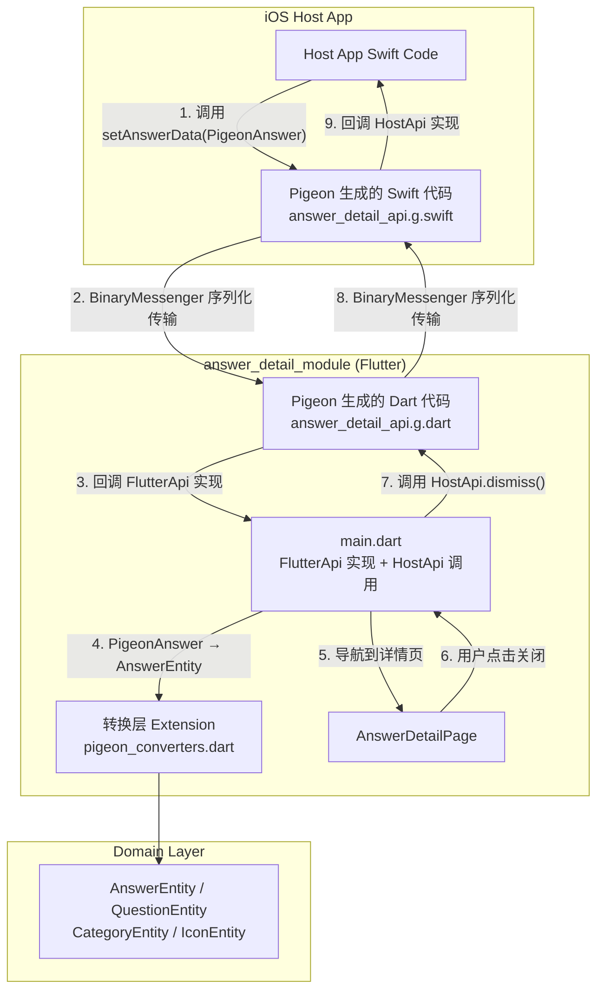

# 设计文档：Pigeon Platform Channel

## 概述

本设计将 `answer_detail_module` 中手写的 MethodChannel 通信代码替换为 Pigeon 自动生成的类型安全通信代码。核心变更包括：

1. 在 `pigeons/` 目录定义 Pigeon schema，声明数据类和双向 API 接口
2. 通过 `dart run pigeon` 自动生成 Dart 和 Swift 两端的通信代码
3. 在 `main.dart` 中用生成的 FlutterApi/HostApi 替换手写的 MethodChannel
4. 提供 Pigeon 消息类 ↔ Domain Entity 的转换层（Extension Methods）
5. 更新 INTEGRATION.md 文档以反映新的集成方式

**设计决策与理由：**

- **选择 Pigeon 而非手写 MethodChannel**：Pigeon 通过 schema 定义自动生成两端代码，消除了方法名字符串不同步、手动序列化/反序列化、类型不安全等问题。
- **转换层使用 Extension Methods**：在 `answer_detail_module` 内部通过 extension 实现 Pigeon 消息类与 Domain Entity 的转换，避免修改 Domain 层（保持 Clean Architecture 的依赖方向）。
- **Schema 文件放在 module 内部**：Pigeon 官方建议生成代码不应跨包使用，因此 schema 和生成代码都放在 `answer_detail_module` 内。

## 架构

### 整体架构图



### 数据流

**iOS → Flutter（推送 Answer 数据）：**

```
Host App (Swift)
  → AnswerDetailFlutterApi.setAnswerData(pigeonAnswer)  [生成的 Swift API]
  → BinaryMessenger 序列化
  → AnswerDetailFlutterApiImpl.setAnswerData(pigeonAnswer)  [Dart 实现]
  → pigeonAnswer.toAnswerEntity()  [Extension 转换]
  → GoRouter.go('/answer_detail', extra: answerEntity)
  → AnswerDetailPage(answer: answerEntity)
```

**Flutter → iOS（通知 dismiss）：**

```
AnswerDetailPage 关闭按钮点击
  → onClose 回调
  → AnswerDetailHostApi().dismiss()  [生成的 Dart API]
  → BinaryMessenger 序列化
  → AnswerDetailHostApi 协议实现  [Swift 端]
  → Host App dismiss FlutterViewController
```

## 组件与接口

### 1. Pigeon Schema 文件

**路径：** `apps/answer_detail_module/pigeons/answer_detail_api.dart`

这是 Pigeon 的输入文件，定义所有数据类和 API 接口。Pigeon 根据此文件自动生成 Dart 和 Swift 代码。

```dart
import 'package:pigeon/pigeon.dart';

@ConfigurePigeon(PigeonOptions(
  dartOut: 'lib/src/generated/answer_detail_api.g.dart',
  swiftOut: 'ios/answer_detail_api.g.swift',
  swiftOptions: SwiftOptions(),
  dartPackageName: 'answer_detail_module',
))

/// iOS → Flutter：原生端推送数据给 Flutter
@FlutterApi()
abstract class AnswerDetailFlutterApi {
  void setAnswerData(PigeonAnswer answer);
}

/// Flutter → iOS：Flutter 端通知原生端执行操作
@HostApi()
abstract class AnswerDetailHostApi {
  void dismiss();
}
```

### 2. FlutterApi 实现类

**路径：** `apps/answer_detail_module/lib/src/answer_detail_flutter_api_impl.dart`

实现 Pigeon 生成的 `AnswerDetailFlutterApi` 抽象类，处理 iOS 端推送的数据。

```dart
class AnswerDetailFlutterApiImpl implements AnswerDetailFlutterApi {
  final GoRouter _router;

  AnswerDetailFlutterApiImpl(this._router);

  @override
  void setAnswerData(PigeonAnswer answer) {
    try {
      final entity = answer.toAnswerEntity();
      _router.go('/answer_detail', extra: entity);
    } catch (e, stackTrace) {
      debugPrint('=== ERROR in setAnswerData: $e ===');
      debugPrint('=== $stackTrace ===');
    }
  }
}
```

### 3. 转换层 Extension

**路径：** `apps/answer_detail_module/lib/src/pigeon_converters.dart`

通过 Extension Methods 实现 Pigeon 消息类与 Domain Entity 之间的转换。

```dart
extension PigeonAnswerConverter on PigeonAnswer {
  AnswerEntity toAnswerEntity() => AnswerEntity(
    id: id,
    content: content,
    createTms: _tryParseDateTime(createTms),
    createYmd: _tryParseDateTime(createYmd),
    question: question?.toQuestionEntity(),
    icon: icon?.toIconEntity(),
  );
}

extension PigeonQuestionConverter on PigeonQuestion {
  QuestionEntity toQuestionEntity() => QuestionEntity(
    id: id,
    title: title,
    category: category.toCategoryEntity(),
    pinned: pinned,
    subCategory: subCategory?.toCategoryEntity(),
    answers: const [],
  );
}

extension PigeonCategoryConverter on PigeonCategory {
  CategoryEntity toCategoryEntity() => CategoryEntity(
    id: id,
    name: name,
    color: color,
  );
}

extension PigeonIconConverter on PigeonIcon {
  IconEntity toIconEntity() => IconEntity(
    status: IconStatus.fromString(status.toUpperCase()),
    url: url,
  );
}

DateTime? _tryParseDateTime(String? value) {
  if (value == null || value.isEmpty) return null;
  return DateTime.tryParse(value);
}
```

### 4. main.dart 改造

**路径：** `apps/answer_detail_module/lib/main.dart`

移除手写 MethodChannel，改用 Pigeon 生成的 API。

关键变更：
- 移除 `MethodChannel('answer_detail_data_channel')` 实例
- 移除 `channel.setMethodCallHandler` 和 `_castMap` 方法
- 在 `initState` 中调用 `AnswerDetailFlutterApi.setUp(impl)` 注册 FlutterApi 实现
- 将 `AnswerDetailHostApi()` 实例传递给 `AnswerDetailPage.onClose`

```dart
class _AnswerDetailModuleAppState extends State<AnswerDetailModuleApp> {
  final AnswerDetailHostApi _hostApi = AnswerDetailHostApi();
  late final GoRouter _router;

  @override
  void initState() {
    super.initState();
    _router = _buildRouter();

    // 注册 FlutterApi 实现，接收 iOS 端推送的数据
    AnswerDetailFlutterApi.setUp(AnswerDetailFlutterApiImpl(_router));
  }

  GoRouter _buildRouter() => GoRouter(
    initialLocation: '/',
    routes: [
      GoRoute(
        path: '/',
        builder: (_, __) => const Scaffold(
          body: Center(child: CircularProgressIndicator()),
        ),
      ),
      GoRoute(
        path: '/answer_detail',
        builder: (_, state) {
          final answer = state.extra as AnswerEntity;
          return AnswerDetailPage(
            answer: answer,
            onClose: () => _hostApi.dismiss(),
          );
        },
      ),
      // ... iconEditor route
    ],
  );
}
```

## 数据模型

### Pigeon 消息类定义（Schema 中声明）

```dart
/// 对应 AnswerEntity
class PigeonAnswer {
  PigeonAnswer({
    required this.id,
    required this.content,
    this.createTms,
    this.createYmd,
    this.question,
    this.icon,
  });

  final String id;
  final String content;
  final String? createTms;   // ISO 8601 格式字符串
  final String? createYmd;   // ISO 8601 格式字符串
  final PigeonQuestion? question;
  final PigeonIcon? icon;
}

/// 对应 QuestionEntity
class PigeonQuestion {
  PigeonQuestion({
    required this.id,
    required this.title,
    required this.category,
    required this.pinned,
    this.subCategory,
  });

  final String id;
  final String title;
  final PigeonCategory category;
  final bool pinned;
  final PigeonCategory? subCategory;
}

/// 对应 CategoryEntity
class PigeonCategory {
  PigeonCategory({
    required this.id,
    required this.name,
    this.color,
  });

  final String id;
  final String name;
  final String? color;
}

/// 对应 IconEntity
class PigeonIcon {
  PigeonIcon({
    required this.status,
    required this.url,
  });

  final String status;  // "GENERATED" | "PENDING" | "FAILED" | "UNKNOWN"
  final String url;
}
```

### Domain Entity 与 Pigeon 消息类的字段映射

| Domain Entity 字段 | 类型 | Pigeon 消息类字段 | 类型 | 转换说明 |
|---|---|---|---|---|
| `AnswerEntity.id` | `String` | `PigeonAnswer.id` | `String` | 直接映射 |
| `AnswerEntity.content` | `String` | `PigeonAnswer.content` | `String` | 直接映射 |
| `AnswerEntity.createTms` | `DateTime?` | `PigeonAnswer.createTms` | `String?` | `DateTime.tryParse(value)` |
| `AnswerEntity.createYmd` | `DateTime?` | `PigeonAnswer.createYmd` | `String?` | `DateTime.tryParse(value)` |
| `AnswerEntity.question` | `QuestionEntity?` | `PigeonAnswer.question` | `PigeonQuestion?` | 递归转换 |
| `AnswerEntity.icon` | `IconEntity?` | `PigeonAnswer.icon` | `PigeonIcon?` | 递归转换 |
| `IconEntity.status` | `IconStatus` | `PigeonIcon.status` | `String` | `IconStatus.fromString(value.toUpperCase())` |
| `QuestionEntity.answers` | `List<AnswerEntity>` | — | — | Pigeon 侧不传递，转换时设为 `const []` |

**设计决策：**
- **DateTime 使用 String 传输**：Pigeon 不直接支持 DateTime 类型，使用 ISO 8601 字符串在两端传输，Dart 端通过 `DateTime.tryParse` 转换。
- **IconStatus 使用 String 传输**：虽然 Pigeon 支持 enum，但 iOS 端已有的数据格式使用字符串（如 `"GENERATED"`），保持 String 传输可减少 iOS 端改动。
- **QuestionEntity.answers 不传递**：在 answer_detail 场景中，Answer 是顶层对象，Question 是其子对象，不需要反向引用 answers 列表。

## 正确性属性

*正确性属性是在系统所有有效执行中都应成立的特征或行为——本质上是对系统应做什么的形式化陈述。属性是人类可读规格说明与机器可验证正确性保证之间的桥梁。*

本功能中，Pigeon 消息类与 Domain Entity 之间的转换逻辑是纯函数，适合属性基测试。Schema 定义、代码生成配置、文档更新等属于静态配置或集成行为，不适合 PBT。

### Property 1: PigeonAnswer → AnswerEntity 转换保持数据完整性

*For any* 有效的 PigeonAnswer 对象（包含各种可空字段组合），将其转换为 AnswerEntity 后，所有字段应正确映射：id 和 content 直接相等，createTms/createYmd 的 String 值经 DateTime.parse 后与转换结果相等，嵌套的 question/icon 字段递归正确映射，可空字段为 null 时转换结果也为 null。

**Validates: Requirements 2.4, 5.1, 5.2, 5.3, 5.5**

### Property 2: 无效 DateTime 字符串的安全处理

*For any* PigeonAnswer 对象，当其 createTms 或 createYmd 字段为 null、空字符串或非 ISO 8601 格式的任意字符串时，转换为 AnswerEntity 后对应的 DateTime 字段应为 null，且转换过程不应抛出异常。

**Validates: Requirements 5.4**

## 错误处理

### 转换层错误处理

| 场景 | 处理方式 |
|---|---|
| `createTms`/`createYmd` 为 null | `_tryParseDateTime` 返回 null |
| `createTms`/`createYmd` 为空字符串 | `_tryParseDateTime` 返回 null |
| `createTms`/`createYmd` 格式无效 | `DateTime.tryParse` 返回 null，不抛异常 |
| `PigeonAnswer.question` 为 null | `AnswerEntity.question` 设为 null |
| `PigeonAnswer.icon` 为 null | `AnswerEntity.icon` 设为 null |
| `PigeonIcon.status` 为未知值 | `IconStatus.fromString` 返回 `IconStatus.unknown` |

### FlutterApi 实现错误处理

| 场景 | 处理方式 |
|---|---|
| `setAnswerData` 转换异常 | try-catch 捕获，debugPrint 输出错误信息，不崩溃 |
| `GoRouter.go` 导航失败 | GoRouter 内部处理，不影响 Flutter 引擎 |

### HostApi 调用错误处理

| 场景 | 处理方式 |
|---|---|
| iOS 端未实现 `AnswerDetailHostApi` | Pigeon 生成的代码抛出 `PlatformException`，由调用方 catch |
| `dismiss()` 调用时 FlutterEngine 已销毁 | BinaryMessenger 层面处理，不影响 Flutter 侧 |

## 测试策略

### 属性基测试（Property-Based Testing）

使用 Dart 的属性基测试库对转换层进行测试。

**测试库选择：** 使用 [`glados`](https://pub.dev/packages/glados) 包（Dart 生态中成熟的 PBT 库），配置每个属性测试运行最少 100 次迭代。

**测试范围：**

| 属性 | 测试内容 | 标签 |
|---|---|---|
| Property 1 | PigeonAnswer → AnswerEntity 转换完整性 | `Feature: pigeon-platform-channel, Property 1: PigeonAnswer to AnswerEntity conversion preserves data integrity` |
| Property 2 | 无效 DateTime 字符串安全处理 | `Feature: pigeon-platform-channel, Property 2: Invalid datetime strings safely convert to null` |

### 单元测试（Example-Based）

| 测试场景 | 类型 | 说明 |
|---|---|---|
| 完整 PigeonAnswer 转换 | Example | 包含所有字段的标准转换 |
| 最小 PigeonAnswer 转换 | Example | 仅必填字段，可选字段全部为 null |
| IconStatus 各枚举值映射 | Example | GENERATED/PENDING/FAILED/UNKNOWN 及无效值 |
| main.dart FlutterApi 注册 | Example | 验证 setUp 调用正确 |
| onClose 回调调用 dismiss | Example | 验证关闭按钮触发 HostApi.dismiss() |

### 集成测试

| 测试场景 | 说明 |
|---|---|
| XCFramework 构建 | `make xcframework MODULE=answer_detail_module` 编译通过 |
| Pigeon 代码生成 | `dart run pigeon --input pigeons/answer_detail_api.dart` 生成文件正确 |

### 冒烟测试

| 测试场景 | 说明 |
|---|---|
| Schema 文件存在 | `pigeons/answer_detail_api.dart` 路径正确 |
| 生成文件存在 | `lib/src/generated/answer_detail_api.g.dart` 和 `ios/answer_detail_api.g.swift` 存在 |
| pubspec.yaml 依赖 | `pigeon` 在 `dev_dependencies` 中声明 |

### 文件结构

```
apps/answer_detail_module/
├── pigeons/
│   └── answer_detail_api.dart          # Pigeon schema 定义
├── lib/
│   ├── main.dart                        # 入口（改造后）
│   └── src/
│       ├── generated/
│       │   └── answer_detail_api.g.dart # Pigeon 生成的 Dart 代码
│       ├── answer_detail_flutter_api_impl.dart  # FlutterApi 实现
│       └── pigeon_converters.dart       # 转换层 Extension
├── ios/
│   └── answer_detail_api.g.swift        # Pigeon 生成的 Swift 代码
├── test/
│   ├── pigeon_converters_test.dart      # 转换层单元测试
│   └── pigeon_converters_property_test.dart  # 转换层属性基测试
└── pubspec.yaml                         # 新增 pigeon dev_dependency
```
