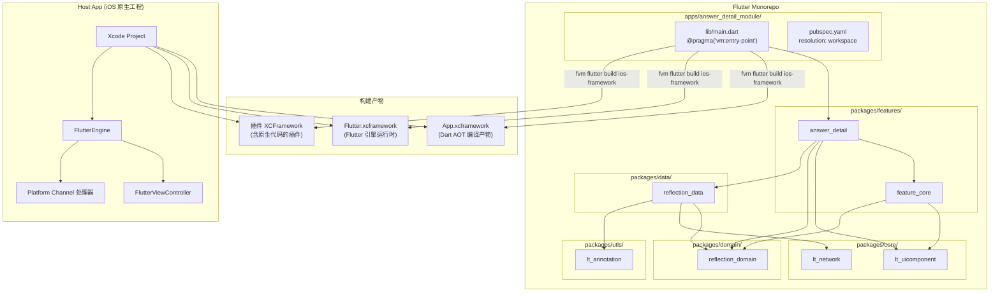
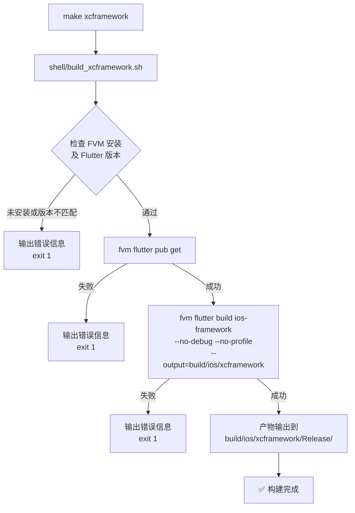

# 技术设计文档：answer_detail 模块编译为 XCFramework

## 概述

本设计文档描述如何将 Flutter monorepo 中的 `answer_detail` 模块及其全部依赖编译为 iOS XCFramework 二进制产物。核心工作包括：

1. 在 `apps/answer_detail_module/` 下创建 Flutter Module 入口工程
2. 实现 Dart 入口（`lib/main.dart`）与路由注册
3. 编写自动化构建脚本（`shell/build_xcframework.sh`）
4. 编写 Host App 集成指南（`INTEGRATION.md`）
5. 将构建命令集成到现有 Makefile

该方案利用 Flutter 官方的 `add-to-app` 机制，通过 `flutter build ios-framework` 命令将 Dart 代码 AOT 编译为 XCFramework，使外部 iOS 原生工程可以直接集成。

## 架构

### 高层架构



### 构建流程



## 组件与接口

### 1. Flutter Module 入口工程（`apps/answer_detail_module/`）

#### 目录结构

```
apps/answer_detail_module/
├── .ios/                          # Flutter 自动生成的 iOS 工程（gitignore）
├── lib/
│   └── main.dart                  # Dart 入口文件
├── test/
├── pubspec.yaml                   # 模块依赖声明
├── INTEGRATION.md                 # Host App 集成指南
└── build/                         # 构建产物输出（gitignore）
    └── ios/
        └── xcframework/
            └── Release/
                ├── App.xcframework
                ├── Flutter.xcframework
                └── [plugin].xcframework
```

#### pubspec.yaml 设计

```yaml
name: answer_detail_module
description: Flutter Module for answer_detail XCFramework build
publish_to: 'none'
resolution: workspace
version: 0.1.0

environment:
  sdk: ^3.8.1

dependencies:
  flutter:
    sdk: flutter

  # 目标模块
  answer_detail:
    path: ../../packages/features/answer_detail

  # 传递依赖（需显式声明以确保路径解析正确）
  feature_core:
    path: ../../packages/features/feature_core
  lt_uicomponent:
    path: ../../packages/core/lt_uicomponent
  reflection_domain:
    path: ../../packages/domain/reflection_domain
  reflection_data:
    path: ../../packages/data/reflection_data
  lt_network:
    path: ../../packages/core/network
  lt_annotation:
    path: ../../packages/utls/lt_annotation

  # answer_detail 使用的外部依赖
  flutter_riverpod: ^3.1.0
  go_router: ^17.0.0
  intl: ^0.20.2

flutter:
  module:
    androidX: true
    androidPackage: com.example.answer_detail_module
    iosBundleIdentifier: com.example.answerDetailModule
```

**设计决策**：
- 使用 `resolution: workspace` 复用 monorepo 根 `pubspec.yaml` 的统一版本管理，避免版本冲突
- 显式声明全部传递依赖的路径引用，确保 Flutter Module 工程能独立解析依赖图
- `flutter.module` 配置是 `flutter create --template module` 的标准结构，Flutter 构建工具依赖此配置生成 `.ios/` 目录

### 2. Dart 入口文件（`lib/main.dart`）

```dart
import 'package:flutter/material.dart';
import 'package:flutter_riverpod/flutter_riverpod.dart';
import 'package:go_router/go_router.dart';
import 'package:answer_detail/answer_detail.dart';
import 'package:reflection_domain/reflection_domain.dart';

@pragma('vm:entry-point')
void main() {
  runApp(
    const ProviderScope(
      child: AnswerDetailModuleApp(),
    ),
  );
}

class AnswerDetailModuleApp extends StatelessWidget {
  const AnswerDetailModuleApp({super.key});

  @override
  Widget build(BuildContext context) {
    final router = GoRouter(
      initialLocation: '/',
      routes: [
        GoRoute(
          path: '/',
          builder: (context, state) {
            // 默认路由：通过 initialRoute 或 MethodChannel 接收 AnswerEntity 数据后导航
            return const Scaffold(
              body: Center(
                child: CircularProgressIndicator(),
              ),
            );
          },
        ),
        GoRoute(
          path: '/answer_detail',
          builder: (context, state) {
            final answer = state.extra as AnswerEntity;
            return AnswerDetailPage(answer: answer);
          },
        ),
        GoRoute(
          path: '/iconEditor',
          builder: (context, state) {
            final imagePath = state.extra as String;
            return ExternalTextureEditor(imagePath: imagePath);
          },
        ),
      ],
    );

    return MaterialApp.router(
      routerConfig: router,
      title: 'Answer Detail Module',
      theme: ThemeData(
        useMaterial3: true,
        scaffoldBackgroundColor: const Color(0xFFFFFDF8),
      ),
    );
  }
}
```

**设计决策**：
- `@pragma('vm:entry-point')` 注解确保 AOT 编译器不会 tree-shake 掉入口函数，这是 add-to-app 场景的必要标记
- 使用 `ProviderScope` 作为根 Widget，与 `lt_app` 的模式一致，确保 Riverpod 状态管理正常工作
- 默认路由 `/` 展示一个加载指示器作为占位界面，Host App 通过 FlutterEngine 的 `initialRoute` 参数或 MethodChannel 传递数据后导航到具体页面
- 路由直接内联定义而非复用 `AnswerDetailRouteConfig`，因为 Module 入口不需要 `rootNavigatorKey` 和 `CustomTransitionPage` 等 Shell 路由特性，简化了依赖关系

### 3. 构建脚本（`shell/build_xcframework.sh`）

```bash
#!/bin/bash
set -euo pipefail

# ============================================================
# answer_detail_module XCFramework 构建脚本
# ============================================================

SCRIPT_DIR="$(cd "$(dirname "${BASH_SOURCE[0]}")" && pwd)"
PROJECT_ROOT="$(cd "$SCRIPT_DIR/.." && pwd)"
MODULE_DIR="$PROJECT_ROOT/apps/answer_detail_module"
OUTPUT_DIR="build/ios/xcframework"
REQUIRED_FLUTTER_VERSION="3.35.7"

# 颜色输出
RED='\033[0;31m'
GREEN='\033[0;32m'
YELLOW='\033[1;33m'
NC='\033[0m'

log_info()  { echo -e "${GREEN}✅ $1${NC}"; }
log_warn()  { echo -e "${YELLOW}⚠️  $1${NC}"; }
log_error() { echo -e "${RED}❌ $1${NC}"; }

# ------------------------------------------------------------
# Step 1: 环境检查
# ------------------------------------------------------------
echo "🔍 检查构建环境..."

if ! command -v fvm &> /dev/null; then
    log_error "FVM 未安装。请先安装 FVM: dart pub global activate fvm"
    exit 1
fi

FVM_FLUTTER_VERSION=$(fvm list | grep -o '3\.[0-9]*\.[0-9]*' | head -1)
if [ "$FVM_FLUTTER_VERSION" != "$REQUIRED_FLUTTER_VERSION" ]; then
    log_error "Flutter 版本不匹配。需要 $REQUIRED_FLUTTER_VERSION，当前为 $FVM_FLUTTER_VERSION"
    log_error "请执行: fvm install $REQUIRED_FLUTTER_VERSION && fvm use $REQUIRED_FLUTTER_VERSION"
    exit 1
fi

log_info "环境检查通过 (Flutter $REQUIRED_FLUTTER_VERSION)"

# ------------------------------------------------------------
# Step 2: 依赖解析
# ------------------------------------------------------------
echo "📦 解析依赖..."

cd "$MODULE_DIR"
if ! fvm flutter pub get; then
    log_error "依赖解析失败 (flutter pub get)"
    exit 1
fi

log_info "依赖解析完成"

# ------------------------------------------------------------
# Step 3: 构建 XCFramework
# ------------------------------------------------------------
echo "🔨 构建 XCFramework (Release)..."

if ! fvm flutter build ios-framework \
    --no-debug \
    --no-profile \
    --output="$OUTPUT_DIR"; then
    log_error "XCFramework 构建失败 (flutter build ios-framework)"
    exit 1
fi

log_info "XCFramework 构建完成"

# ------------------------------------------------------------
# Step 4: 验证产物
# ------------------------------------------------------------
echo "🔎 验证构建产物..."

RELEASE_DIR="$MODULE_DIR/$OUTPUT_DIR/Release"

if [ ! -d "$RELEASE_DIR/App.xcframework" ]; then
    log_error "缺少 App.xcframework"
    exit 1
fi

if [ ! -d "$RELEASE_DIR/Flutter.xcframework" ]; then
    log_error "缺少 Flutter.xcframework"
    exit 1
fi

log_info "产物验证通过"

# ------------------------------------------------------------
# 完成
# ------------------------------------------------------------
echo ""
log_info "🎉 XCFramework 构建成功！"
echo "   产物目录: $RELEASE_DIR"
echo "   包含:"
ls -1 "$RELEASE_DIR" | grep '\.xcframework$' | while read -r fw; do
    echo "     - $fw"
done
```

**设计决策**：
- 使用 `set -euo pipefail` 确保任何命令失败都会立即终止脚本
- FVM 版本检查从 `fvm list` 输出中提取版本号，确保与 `.fvmrc` 中声明的版本一致
- 使用 `--no-debug --no-profile` 仅构建 Release 配置，减少构建时间和产物体积
- 构建完成后自动验证核心产物（`App.xcframework` 和 `Flutter.xcframework`）是否存在
- 每个步骤失败时输出明确的步骤名称和错误信息，便于排查问题

### 4. Makefile 集成

在现有 Makefile 中新增 `xcframework` 目标：

```makefile
xcframework:
	@echo "🔨 构建 answer_detail XCFramework..."
	@bash shell/build_xcframework.sh
```

同时更新 `help` 目标，添加 `xcframework` 命令说明。

### 5. Host App 集成指南（`INTEGRATION.md`）

集成文档包含以下章节：

1. **XCFramework 产物说明** — 列出所有生成的 XCFramework 及其用途
2. **Xcode 工程配置步骤** — 如何将 XCFramework 添加到 Xcode 工程
3. **FlutterEngine 初始化** — Swift 代码示例，展示如何创建和启动 FlutterEngine
4. **展示 Flutter 页面** — 如何使用 FlutterViewController 展示 Flutter 界面
5. **Platform Channel 注册** — 如何注册全部 Platform Channel 处理器
6. **数据传递** — 如何通过 initialRoute 或 MethodChannel 传递 AnswerEntity 数据

## 数据模型

### AnswerEntity 数据传递格式

Host App 需要将 `AnswerEntity` 数据传递给 Flutter 模块。数据通过 JSON 格式在 Platform Channel 上传输：

```json
{
  "id": "string",
  "content": "string",
  "createdAt": "ISO8601 datetime string",
  "question": {
    "id": "string",
    "title": "string",
    "category": { "id": "string", "name": "string" },
    "pinned": false,
    "subCategory": null
  },
  "icon": {
    "status": "GENERATED | PENDING | FAILED | UNKNOWN",
    "url": "string"
  }
}
```

`AnswerEntity` 已提供 `toJson()` 和 `fromJson()` 方法，可直接用于序列化/反序列化。

### Platform Channel 接口规范

| Channel 类型 | Channel 名称 | 方向 | 方法/用途 |
|---|---|---|---|
| UiKitView | `plugin.metal_overlay_view` | Flutter → Native | 嵌入原生 Metal 渲染视图，`creationParams` 包含 `{'imagePath': String}` |
| MethodChannel | `metal_texture_channel` | Flutter → Native | `initializeTexture({'imagePath': String}) → int?`（返回 textureId）<br/>`updateColor([double r, double g, double b, double a]) → void` |
| MethodChannel | `color_overlayer_{id}` | Flutter → Native | `updateColor([double r, double g, double b, double a]) → void`<br/>`{id}` 为 UiKitView 创建时返回的 platformViewId |

#### Platform Channel 方法签名详情

**`metal_texture_channel`**

| 方法名 | 参数 | 返回值 | 说明 |
|---|---|---|---|
| `initializeTexture` | `Map<String, dynamic>` — `{'imagePath': String}` | `int?` — textureId | 初始化 Metal 纹理，返回 Texture widget 使用的 textureId |
| `updateColor` | `List<double>` — `[red, green, blue, alpha]`，值域 `[0.0, 1.0]` | `void` | 更新 Metal 纹理的颜色叠加参数 |

**`color_overlayer_{id}`**

| 方法名 | 参数 | 返回值 | 说明 |
|---|---|---|---|
| `updateColor` | `List<double>` — `[red, green, blue, alpha]`，值域 `[0.0, 1.0]` | `void` | 更新指定 Metal Overlay View 的颜色叠加参数 |

## 错误处理

### 构建脚本错误处理

| 错误场景 | 处理方式 | 退出码 |
|---|---|---|
| FVM 未安装 | 输出安装指引，终止执行 | 1 |
| Flutter 版本不匹配 | 输出当前版本和期望版本，终止执行 | 1 |
| `flutter pub get` 失败 | 输出 "依赖解析失败"，终止执行 | 1 |
| `flutter build ios-framework` 失败 | 输出 "XCFramework 构建失败"，终止执行 | 1 |
| 产物验证失败（缺少 xcframework） | 输出缺少的产物名称，终止执行 | 1 |

### Platform Channel 错误处理

- 当 Host App 未注册对应的 Platform Channel 处理器时，Flutter 框架会自动抛出 `MissingPluginException`
- 这是 Flutter 的标准行为，不需要额外的错误处理代码
- `ExternalTextureEditor` 中 `_initTexture()` 的 `invokeMethod` 调用如果失败，`_textureId` 保持 `null`，UI 会持续显示 `CircularProgressIndicator`
- `MetalOverlayEditor` 中 `_updateNativeColor()` 在 `_channel` 为 `null` 时不执行调用（已有空值检查）

## 测试策略

### PBT 适用性评估

本特性 **不适用** 属性基测试（Property-Based Testing）。原因：

- 本特性的核心工作是 **项目脚手架搭建**（创建 Flutter Module 工程）、**构建自动化**（shell 脚本）和 **文档编写**（集成指南）
- 构建脚本是确定性的 shell 脚本，不是具有可变输入的纯函数
- Platform Channel 兼容性是保留现有代码行为，不涉及新的业务逻辑
- 没有可以用 "对于所有输入 X，属性 P(X) 成立" 来表述的通用属性

### 测试方案

#### Smoke 测试（配置验证）

| 测试项 | 验证内容 |
|---|---|
| Flutter Module 工程结构 | `apps/answer_detail_module/` 目录存在，包含 `pubspec.yaml` 和 `lib/main.dart` |
| pubspec.yaml 依赖声明 | 包含 `answer_detail` 及全部传递依赖的路径引用 |
| workspace 集成 | `resolution: workspace` 存在，根 `pubspec.yaml` workspace 列表包含该模块 |
| SDK 版本约束 | `environment.sdk` 为 `^3.8.1` |
| 入口注解 | `main.dart` 包含 `@pragma('vm:entry-point')` |
| 构建脚本存在性 | `shell/build_xcframework.sh` 存在且可执行 |
| Makefile 目标 | `Makefile` 包含 `xcframework` 目标 |
| 集成文档 | `INTEGRATION.md` 存在 |

#### Example 测试（具体场景）

| 测试项 | 验证内容 |
|---|---|
| 根 Widget 结构 | `main()` 中 `runApp` 的参数包含 `ProviderScope` |
| 路由注册 | GoRouter 配置包含 `/`、`/answer_detail`、`/iconEditor` 三个路由 |
| FVM 未安装场景 | 脚本输出错误信息并以退出码 1 终止 |
| 构建步骤失败场景 | 脚本输出失败步骤名称和错误信息 |
| Platform Channel 名称 | `metal_texture_channel`、`plugin.metal_overlay_view`、`color_overlayer_{id}` 保持不变 |

#### 集成测试

| 测试项 | 验证内容 |
|---|---|
| 依赖解析 | `fvm flutter pub get` 在模块目录下执行成功 |
| XCFramework 构建 | `fvm flutter build ios-framework` 生成 `App.xcframework` 和 `Flutter.xcframework` |
| 架构验证 | XCFramework 包含 arm64 架构 |
| Host App 编译 | 集成全部 XCFramework 后 Xcode 工程编译通过 |
